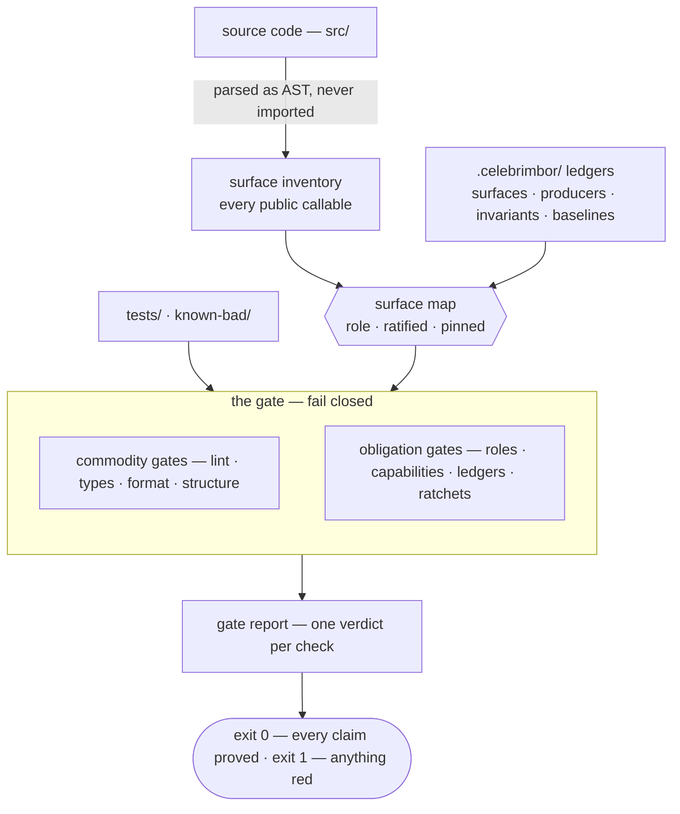

# How it fits together

celebrimbor isn't a bag of independent linters. It's one pipeline built around a
single source of truth — the **role map**, the list of every public function in
your code and the job you've assigned each one — that every check reads. This page
is the map of the territory; the pages after it zoom in.

## The pipeline

## The five stages, and why each is shaped the way it is

**1 · Inventory — read the code, never run it.**
celebrimbor finds your public surface by parsing the source text, not by importing
it. Importing runs code, and code that won't import can't be classified — so an
import-based tool goes blind exactly when something is broken. Reading from the
text means the list of your functions can never fall behind code that doesn't run.
→ [Surface roles](../gate/surface.md)

**2 · The role map — classify, then confirm, then pin.**
Every function gets a **role** (`pure`, `parser`, `verifier`, `producer`, …) — the
job it does. Roles are *guessed for you* to shrink the work, but a guessed role is
red until a human *confirms* it (*ratifies* it), and that confirmation is *pinned*
to the shape of the code it was signed off on. Change the code's character and the
pin breaks, re-opening the question. This is the single source of truth every check
downstream reads.
→ [Roles & obligations](roles.md)

**3 · The ledgers — write down the promises, checked against the code.**
Producers, invariants, and waivers live in small YAML files under `.celebrimbor/`.
They aren't trusted config: every entry is checked for consistency against the code
(a named verifier must resolve to a real verifier; a critical invariant must keep a
real negative proof — a kept example of the bad thing it must reject).
→ [Ledgers](../gate/ledgers.md)

**4 · The gate — two families, one fail-closed rule.**
The **everyday checks** (the `commodity` family) need no ledger and pass on a fresh
repo. The **proving checks** (the `obligation` family) are opt-in and read the map
and the ledgers. Both obey one rule: when a check can't *prove* its claim, it
refuses (goes red) rather than estimating.
→ [Stages and families](../gate/stages-and-families.md) · [Fail closed](fail-closed.md)

**5 · The report — a verdict, and an exit code.**
Every check produces exactly one verdict, the report gathers them, and the exit
code is `0` only if everything that ran proved its claim. An empty report is red,
not green.

## Why one spine instead of many tools

Because every check reads the same confirmed-then-pinned map, the checks
*reinforce* each other instead of each seeing only its own slice:

- the **capability** gate can be trusted only because the **evidence** gate has
  proven the role honest;
- the **impact** gate means something only because the **completeness** gate has
  proven the map accounts for every function;
- the **producers** gate is only as strong as the **evidence** gate that keeps a
  declared `verifier` from being blind.

A pile of separate tools can't give you that. This wiring between the checks — not
any single idea — is what celebrimbor is.

→ [The thesis](thesis.md) · [Why celebrimbor](why.md)
