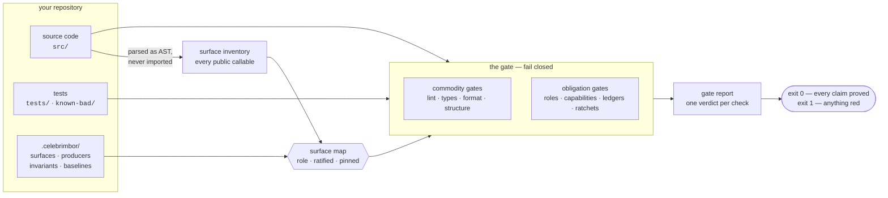

# How it fits together

celebrimbor is not a bag of independent linters. It is one pipeline with a
single source of truth — the **role map** — that every gate reads. This page is
the map of the territory; the pages after it zoom in.

## The pipeline

## The five stages, and why each is shaped the way it is

**1 · Inventory — read the AST, never import.**
celebrimbor discovers your public surface by parsing source, not by importing
it. Importing runs code, and code that will not import cannot be classified — so
an import-based tool goes blind exactly when something is broken. Parsing means
completeness can never fall behind code that does not run.
→ [Surface roles](../gate/surface.md)

**2 · The role map — classify, then ratify, then pin.**
Every callable gets a **role** (`pure`, `parser`, `verifier`, `producer`, …).
Roles are *inferred* to shrink the work, but an inferred role is red until a
human *ratifies* it, and ratification is *pinned* to the shape of the code it was
signed off on. Change the code's character and the pin breaks, re-opening the
question. This is the single source of truth every gate downstream consults.
→ [Roles & obligations](roles.md)

**3 · The ledgers — declare the promises, checked against the code.**
Producers, invariants, and waivers live in small YAML files under
`.celebrimbor/`. They are not trusted config: every entry is validated for
referential integrity against the code (a named verifier must resolve to a real
verifier; a critical invariant must keep a real negative proof).
→ [Ledgers](../gate/ledgers.md)

**4 · The gate — two families, one fail-closed rule.**
`commodity` gates need no ledger and pass on a fresh repo; `obligation` gates are
opt-in and read the map and ledgers. Both obey one rule: when a gate cannot
*prove* its claim, it refuses (red) rather than estimating.
→ [Stages and families](../gate/stages-and-families.md) · [Fail closed](fail-closed.md)

**5 · The report — a verdict, and an exit code.**
Every check yields exactly one verdict, the report aggregates them, and the exit
code is `0` only if everything that ran proved its claim. An empty report is red,
not green.

## Why one spine instead of many tools

Because every gate reads the same ratified-then-pinned map, the gates *reinforce*
each other instead of each seeing its own slice:

- the **capability** gate can be trusted only because the **evidence** gate has
  proven the role honest;
- the **impact** gate is meaningful only because the **completeness** gate has
  proven the map accounts for every callable;
- the **producers** gate is only as strong as the **evidence** gate that keeps a
  declared `verifier` from being blind.

A pile of separate tools cannot give you that. This coupling — not any single
idea — is what celebrimbor is.

→ [The thesis](thesis.md) · [Why celebrimbor](why.md)
