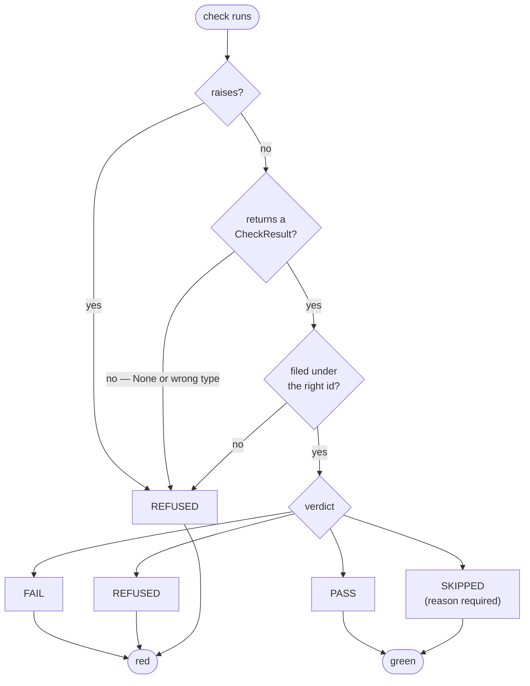
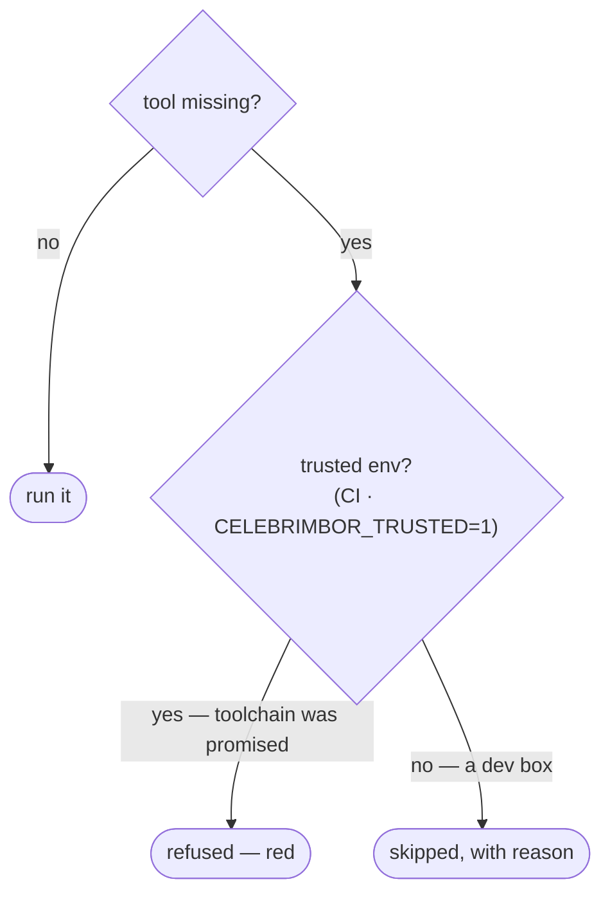

# Fail closed

The core rule: **when celebrimbor can't prove something, it refuses.** It never
estimates, defaults, or passes. Every check inherits this, because it's enforced
in one place — the small vocabulary results are built from — so no check can
forget it.

## Four verdicts, not two

A check doesn't just return true or false. It returns a verdict:

| Verdict | Glyph | Meaning | Red? |
|---|:--:|---|---|
| `pass` | `✓` | the claim was checked and held | no |
| `fail` | `✗` | the claim was checked and violated — a finding is attached | **yes** |
| `refused` | `⊘` | the claim could **not** be checked | **yes** |
| `skipped` | `–` | the check does not apply here — carries a reason | no |

The split between `fail` and `refused` is the load-bearing part. `fail` means
celebrimbor proved a violation and can point right at it. `refused` means it
couldn't reach a conclusion at all — a config file was missing, a module wouldn't
parse, a tool wasn't installed, a git diff couldn't be computed. Both are red, but
they call for different fixes, and blurring them is how "we couldn't check"
quietly becomes "there's nothing wrong."

## The constructor enforces it

These rules live in the `CheckResult` constructor and nowhere else, so a malformed
result — which is a bug in a *check* — can't come out green:

- A `skipped` result **must** carry a reason. You can't write the silent skip; the
  constructor rejects it.
- A `fail` result **must** carry at least one finding. If a check can't point at
  the violation, it has to `refuse` instead.
- A `refused` result **must** say what it couldn't establish.
- An **empty gate report is red.** A gate that ran zero checks proved nothing, and
  calling that green is exactly the looks-right-but-isn't outcome the project
  exists to prevent.

## The runner cannot leak green

Every way a check can misbehave is turned into `refused` by the runner — the one
place check-authored code is actually called:

- a check that **raises** → `refused`, with the traceback as the reason;
- a check that **returns `None`** or the wrong type → `refused`;
- a check that files its result under the **wrong id** → `refused` (a misfiled
  result would look like both a missing check and a stray pass).

None of these paths can produce `pass`. That's the property that makes the runner
itself fail closed. Every branch that ends in "we couldn't prove it" funnels to
red:

The diagram has one deliberate asymmetry: there are three ways to reach red and
only two to reach green, and every "couldn't tell" arrow points at red. That's
fail-closed drawn out — uncertainty doesn't get the benefit of the doubt.

## The no-silent-skip promise

A missing tool is the single most dangerous case, because the natural way to
handle it — warn and carry on — looks identical to a pass in any summary. So the
handling depends on whether a promise was made:

- In a **trusted environment** (CI, or `CELEBRIMBOR_TRUSTED=1`), the toolchain is
  promised present. A missing tool is a broken promise: **refused**, red.
- Without that promise (your dev box), skip — *with the reason on the record* — so
  a contributor who hasn't installed mypy isn't blocked from committing by a gate
  CI will run properly anyway.

The asymmetry is the point: the place where the answer matters — CI, where green
is a promise to everyone else — is the place that fails closed.

## Every gate is proven to fail

A check that has never been seen to turn red is a blind check. So every check
ships with a **negative fixture** — a kept example, on the record, that turns it
red — and a meta-test resolves every `falsified_by` to a real test. Celebrimbor
holds its own checks to this, including the check that checks the checks.
