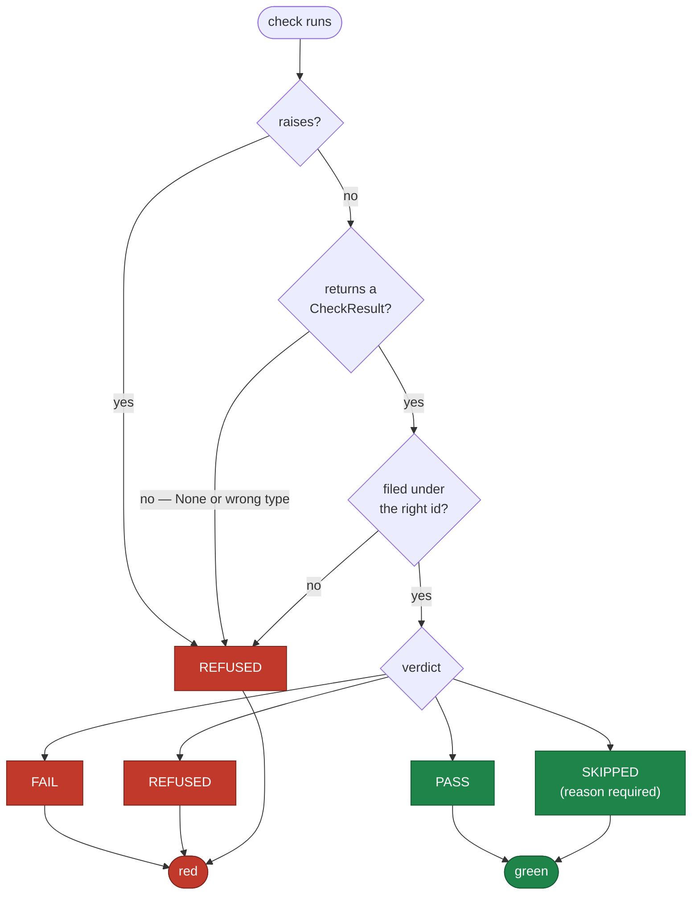
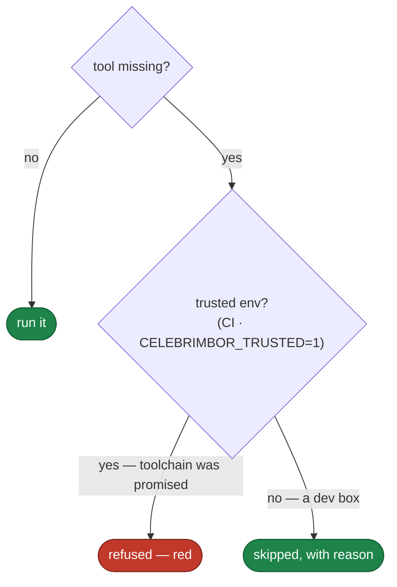

# Fail closed

The core invariant: **when celebrimbor cannot prove something, it refuses.** It
never estimates, defaults, or passes. Every engine inherits this, and it is
enforced in one place — the result vocabulary — so no engine can forget it.

## Four verdicts, not two

A check does not return a boolean. It returns a verdict:

| Verdict | Glyph | Meaning | Red? |
|---|:--:|---|---|
| `pass` | `✓` | the claim was checked and held | no |
| `fail` | `✗` | the claim was checked and violated — a finding is attached | **yes** |
| `refused` | `⊘` | the claim could **not** be checked | **yes** |
| `skipped` | `–` | the check does not apply here — carries a reason | no |

The split between `fail` and `refused` is load-bearing. `fail` means the harness
proved a violation and can point at it. `refused` means it could not reach a
conclusion — a config file was missing, a module would not parse, a tool was
absent, a git diff could not be computed. Both are red, but they demand different
fixes, and collapsing them is how "we couldn't check" silently becomes "there's
nothing wrong."

## The constructor enforces it

These rules live in the `CheckResult` constructor and nowhere else, so a
malformed result — which is a bug in a *gate* — cannot produce green:

- A `skipped` result **must** carry a reason. You cannot write the silent skip;
  the constructor rejects it.
- A `fail` result **must** carry at least one finding. If a gate cannot point at
  the violation, it must `refuse` instead.
- A `refused` result **must** explain what it could not establish.
- An **empty gate report is red.** A gate that ran zero checks proved nothing,
  and reporting green for it is exactly the plausible-but-wrong outcome the
  project exists to prevent.

## The runner cannot leak green

Every way a check can misbehave is converted to `refused` by the runner, which
is the sole place check-authored code is called:

- a check that **raises** → `refused`, with the traceback in the reason;
- a check that **returns `None`** or a wrong type → `refused`;
- a check that files its result under the **wrong id** → `refused` (a misfiled
  result would read as both a missing check and a stray pass).

None of these paths can produce `pass`. That is the property that makes the
runner itself fail closed. Every branch that ends in "we could not prove it"
funnels to red:

The diagram has one deliberate asymmetry: there are three ways to reach red and
only two to reach green, and every "could not tell" arrow points at red. That is
fail-closed drawn out — uncertainty is not given the benefit of the doubt.

## The no-silent-skip promise

A missing tool is the single most dangerous outcome, because the natural handling
— warn and carry on — is indistinguishable from a pass in any summary. So the
handling depends on whether a promise was made:

- In a **trusted environment** (CI, or `CELEBRIMBOR_TRUSTED=1`), the toolchain is
  promised present. A missing tool is a broken promise: **refused**, red.
- Without that promise (a dev box), skip — *with the reason on the record* — so a
  contributor who has not installed mypy is not blocked from committing by a gate
  CI will run properly anyway.

The asymmetry is the point: the place where the answer matters — CI, where a
green is a promise to everyone else — is the place that fails closed.

## Every gate is proven to fail

A gate that has never been observed to turn red is a blind gate. So every gate
ships with a **negative fixture** — an input on the record that turns it red —
and a meta-test resolves every `falsified_by` to a real test. Celebrimbor holds
its own gates to this, including the gate that checks the gates.
