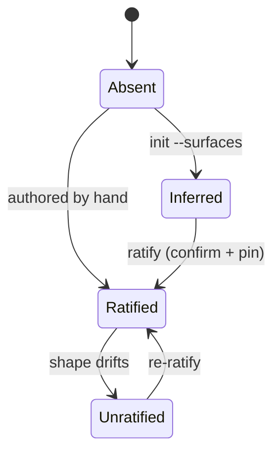

# Roles & obligations

The role is celebrimbor's spine — its single source of truth. Every public
function has one. A *role* is the job a function does, but more precisely it names
*the kind of proof a function of that job owes* — not what it does, but how it
earns your trust.

## The taxonomy

| Role | Owes | Capability budget |
|---|---|---|
| `pure` | a property or unit test over its contract | nothing |
| `parser` | a unit test with malformed input that must be refused | nothing |
| `normalizer` | a property test (idempotence and folding) | nothing |
| `verifier` | a negative fixture that must turn it red | filesystem |
| `producer` | proof through the verifier that inspects its artifact | filesystem |
| `orchestrator` | an interaction test over its dependency edges | nothing |
| `adapter` | a contract test against fake and real backends | everything |
| `presenter` | an integration or end-to-end run | filesystem, process, environment |

The third column is the **capability budget** — the pieces of the outside world
(the clock, the network, files, randomness) a function of that role is allowed to
*reach for* directly instead of being handed. It's enforced by the [capabilities
gate](../gate/capabilities.md), and it's why `adapter` — the one role that talks to
the outside world — carries an open budget while `pure` carries none.

You assign roles **by module default, with per-function overrides** — never one
row per function. A five-hundred-function app has a map of a few dozen lines,
because a map nobody can read is a map nobody confirms. A function that genuinely
owes no direct proof is *exempted* by name, with a reason and a review date —
never silently. Here's a real fragment of `.celebrimbor/surfaces.yaml`:

```yaml
version: 1
modules:
  myapp.parsing:            # every callable here is a parser…
    role: parser
    status: ratified
    pin: "a1b2c3d4e5f6"     # the shape this role was ratified against
    overrides:
      dump_debug: pure      # …except this one, a plain serializer
  myapp.reporting:
    role: producer
    status: inferred        # RED until a human ratifies it
exemptions:
  myapp.parsing:_scratch:   # owes no direct proof, on the record
    reason: internal cache key; covered by the round-trip test
    review_by: 2026-10-01
```

A whole 57-module map written this way — celebrimbor's own — is
[on GitHub](https://github.com/clintecker/celebrimbor/blob/main/.celebrimbor/surfaces.yaml).

## Inference, and its safe direction

You don't write the map from scratch. `celebrimbor init --surfaces` runs a naming
heuristic (`verify_*` → verifier, `parse_*` → parser, `build_*` → producer, and so
on) and pre-fills the rows it's confident about.

Two rules make that guessing trustworthy:

- **It holds back rather than guessing.** A function whose name carries no signal
  gets *no row*. There's no "unclassified" value to confirm.
- **It only ever proposes roles that demand *more* proof.** Inference will never
  propose `pure` or `presenter` — the two "escape" roles that owe the least —
  because a wrong guess *there* silently voids the very gates that key on role.
  Over-demanding proof costs an author some test-writing; under-demanding it ships
  an unchecked function. Inference errs toward more proof, always.

Every inferred row is written `status: inferred`, which is **red until a human
confirms it** (*ratifies* it). Inference shrinks your job to a one-line confirm; it
never manufactures green.

## A role is a claim, not a label

This is the part that makes the map trustworthy under real, messy code. Declaring a
role doesn't make it true — the code has to be consistent with it. The [evidence
gate](../gate/surface.md#evidence) — the check that reads your code and makes sure
each function actually does the job you assigned — reads the necessary conditions a
role implies straight from the syntax (the parsed source, or AST):

- a `verifier` whose every return path is a truthy literal, with no raise, *can
  never turn red* — refused;
- a `parser` with no reachable failing path can't refuse malformed input —
  refused;
- an `adapter` that touches no capability and calls nothing it was handed is not
  adapting anything — refused (this closes the "declare `adapter` to unlock the
  unrestricted capability budget" escape);
- a `pure` function that mutates a parameter, or reaches for the clock, isn't pure
  — refused.

These are *contradiction detectors*, not proofs of correctness. They catch a role
that's provably wrong; the positive proof still lives in your tests.

!!! note "Refusal is mechanism-agnostic"
    A `parser` refuses malformed input by *raising* or by *returning* a value
    that encodes refusal (a `Result`, an error-carrying dataclass, `None`) —
    both are the same claim in different channels, and the value channel is the
    more disciplined one. The evidence gate keys on "has a reachable failing
    path", the same test it uses for verifiers, so ordinary total parsers
    are not false-flagged.

## Ratification is pinned to the code

When you confirm a row by hand (*ratify* it), celebrimbor stamps a **pin** — a
hash of the function's role-relevant *shape*: which capabilities it reaches for,
whether it can fail, whether it mutates its inputs, roughly how many collaborators
it has, its complexity band. The pin deliberately ignores names, literals, and
formatting.

Your confirmation is a judgment made at one moment, about code that keeps moving.
The pin ties that judgment to the exact code it was made about. Rename a local
variable or fix a typo and nothing happens. Rewrite a three-line parser into
something that opens a socket, and the shape changes, the pin breaks, and the row
**reverts to un-ratified** — red until a human looks again. This is the answer to
"someone edited it into something more complex and never reclassified it."



The states colour-code simply: **`Absent`** (a function with no row is a hole),
**`Inferred`** (a guess is not a judgment), and **`Unratified`** (the sign-off is
about older code) are all **red**. Only **`Ratified`** is **green** — and the only
way in is a human confirmation, so inference and drift both leave you red.

## The obligation rank

The roles are ordered by how much isolating proof they demand — highest to lowest:

```
producer (7)  >  verifier (6)  >  adapter (5)  >  parser (4) ≈ orchestrator (4)
              >  normalizer (3)  >  pure (1) ≈ presenter (1)
```

`pure` and `presenter` — the two escape roles — sit at the bottom, and inference
is *forbidden* from ever proposing them (a wrong guess there silently voids the
gates). The ordering exists for exactly one reason: the safe-direction rule above.
When inference is torn between two roles it proposes the higher-ranked one; when
two tie, it holds back.

## Policy roles and the impact gate

Six of the eight roles are **policy-bearing** — they *decide* or *attest*
something, so a change to them changes what your system guarantees:

| Policy roles | Not policy |
|---|---|
| `parser` · `normalizer` · `verifier` · `producer` · `orchestrator` · `adapter` | `pure` · `presenter` |

This is what the [change-impact gate](../gate/ledgers.md#the-impact-gate) — the
check that flags when you change important code that no recorded promise is
watching over — keys on. When a commit changes a module whose role is
policy-bearing, the gate asks: *is there a recorded invariant governing this?* If
not, the change quietly alters a guarantee in a place with no promise watching it —
and the gate reddens. A change to a `pure` helper carries no such obligation,
because a pure function decides nothing about the system's promises. Which roles
count as policy is [configurable](../reference/configuration.md) (`policy_roles`),
so it can match an existing setup's notion of one.
