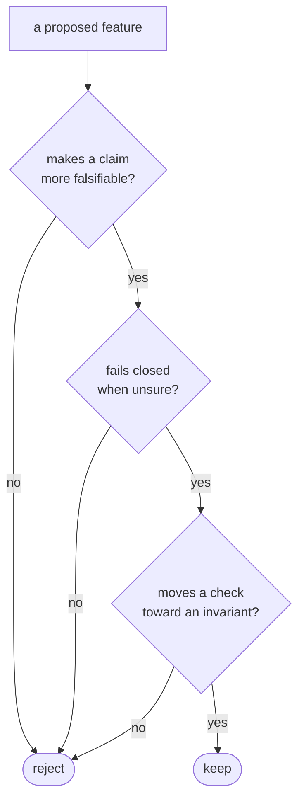

# The thesis

Celebrimbor is built on one idea: **make your code prove it isn't quietly
broken, and stop when it can't.**

The one-paragraph version: a claim your code can't be caught getting wrong is a
claim it will eventually get wrong. AI-written code is especially prone to this,
because a language model is built to produce something that *looks* right — and
looks-right is exactly where a hidden flaw survives. So celebrimbor holds every
part of your application to one rule: it must carry a way it could be caught being
wrong — in practice, a test that genuinely fails when the code breaks. We call
that a *falsifier*. And the gate — the single command that runs every check —
**fails closed**: when it can't prove something is right, it stops and refuses
rather than waving the code through.

That is the lesson the tool is named for. Celebrimbor forged the Rings of Power
and was deceived into hiding a flaw he couldn't see, by a visitor who looked
trustworthy — so never trust a thing because it looks right; make it prove it
isn't secretly flawed.

Three principles follow from that, and every design decision in the code serves
them.

## Self-falsifying claims

If a piece of code asserts something, it has to prove it — and that proof isn't
optional, it's a required argument. The `@check` decorator has no default for
`falsified_by`; you can't register a check without naming how it can fail:

```python
@celebrimbor.check(
    id="myapp.manifest",
    title="every artifact is listed",
    falsified_by="tests/known-bad/manifest_missing.json",  # ← not optional
)
def check_manifest(ctx): ...
```

The same shape shows up everywhere:

- A `producer` — a function that builds an artifact — must name a `verifier` that
  inspects what it built, and that verifier must name a kept example of the bad
  case that turns it red (a *negative fixture*). You can't inherit a verifier that
  checks nothing.
- The job you assign a function (its *role*) is checked against the actual code
  (the [evidence gate](../gate/surface.md#evidence)), so a `verifier` that can
  never fail is refused.

The pattern repeats at every level: the same discipline the tool applies to your
code, it applies to its own checks, and to [the checks on those
checks](../gate/meta.md).

## Fail closed

When celebrimbor can't establish something, it goes red — it never estimates,
defaults, or passes. A missing config file, a module it can't parse, a tool
that's absent where it was promised, a git diff it can't compute: all of these
**refuse**, which is a distinct outcome from both *pass* and *fail*. "We couldn't
check" must never quietly turn into "there's nothing wrong."

This is enforced in the type system, in one place, so no check can forget it:
results are built through a small vocabulary where a skipped check has to carry a
reason, a failure has to carry a specific finding, and a gate that ran nothing is
red because it proved nothing. See [Fail closed](fail-closed.md).

## Invariants over checks

Wherever you can, make a broken state impossible to represent in the first place,
rather than checking for it after the fact. The clearest example: there is no "I
don't know" role. An earlier design had one, and it was deleted — because a role
that means "unclassified" could still be confirmed by hand (*ratified*), and every
check that keys on role would then read a real, signed-off, meaningless value.
`Role.parse` now *raises* on anything outside the eight roles; the illegal value
can't be built, let alone ratified. When the tool can't tell what a function does,
it produces *nothing* — an unclassifiable module simply gets no row, and the
completeness check reddens the gap.

## The compass

When a design decision is unclear, three questions settle it — and a "no" to any
one is a "no" to the feature:



If a proposed feature would let a piece of code assert something it can't be
forced to prove, it's the wrong feature — no matter how convenient.
