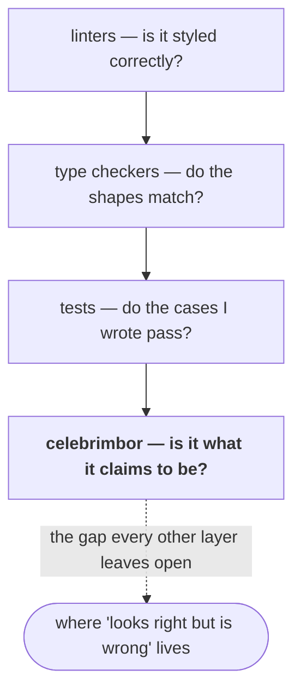

# Why celebrimbor

This page makes the case with real examples. If you're already sold and just want
to use the tool, [Getting started](../getting-started.md) is the page you want.

## What your existing tools can't see

Here are four functions. Every one of them passes `ruff`, passes `mypy --strict`,
and passes a test suite — including tests an AI wrote to go with the code.

```python
def verify_invoice(inv: Invoice) -> bool:
    """Check the invoice is well-formed."""
    if inv.total < 0:
        ...  # TODO: handle
    return True                      # (1) never returns False

def parse_config(raw: str) -> Config:
    """Parse the config."""
    data = json.loads(raw)
    return Config(**data)            # (2) never rejects malformed input;
                                     #     raises AttributeError, not a refusal

def slugify(title: str) -> str:
    """Normalize a title to a slug."""
    return f"{title.lower()}-{datetime.now():%s}"  # (3) 'pure' function reads the clock

def test_pricing():
    price = compute_price(cart)
    assert price is not None         # (4) asserts nothing that can really fail
```

1. A **checker that can't fail.** Its one job is to reject bad invoices — and it
   never does. Every call comes back green. Test coverage is 100%. It's *worse*
   than having no check, because it manufactures confidence.
2. A **parser that doesn't parse.** It handles good input and blows up on
   anything else with an accidental `AttributeError`. It never actually
   *rejects* bad input on purpose — so there's no clean way to prove it guards
   against it.
3. A **"pure" function with a hidden dependency.** Its output depends on the
   current time. No test can pin it down, because there's no way to hand it a
   fake clock. What does it do at a leap second? Nobody can write that test.
4. A **test that can't fail.** `is not None` is true for every value that isn't
   `None` — including a completely wrong one.

Linters check style. Type checkers check shapes. Tests check the cases you
thought to write. **None of them ask whether the code is what it claims to be.**
That question goes unanswered by all your everyday tools — and it's exactly the
question that matters for code you didn't write by hand: code from an AI, or from
six months ago, or from someone else.



Each layer answers a real question. None of them answers the last one.

## What celebrimbor does about each one

celebrimbor gives every function a **role** — the job it does — and each role
comes with a specific kind of proof that job requires. Each failure above is
caught by a specific, mechanical check, not by a reviewer paying close attention:

| Failure | Caught by | How |
|---|---|---|
| Checker that can't fail (1) | the evidence check | a `verifier` whose every path returns a truthy value *can never turn red* — you can see it right in the code's structure |
| Parser that doesn't reject (2) | the evidence check | a `parser` with no path that actually rejects is refused; and it owes a saved example of bad input it must turn away |
| "Pure" function that isn't (3) | the capabilities check | `datetime.now()` is a reach into the outside world; a `pure` function is allowed no such reach, so the grabbed clock turns it red |
| Empty test (4) | the marker check | a test with no real assertion can't fail, so it proves nothing, and is rejected |

None of these are matters of taste. They're structural facts about the code that
the gate reads straight off it. An author — person or model — can't satisfy the
gate by being *convincing*; they have to produce code that carries a way to catch
it being wrong.

## Why this is the right shape for AI-written code

A language model is a plausibility machine. Given a task, it produces the
most likely-*looking* code — and likely-looking is exactly what slips past tools
that check form rather than proof. That's not a knock on models; it's what
they're built to do. But it means the burden of catching mistakes lands on you,
and "looks correct" is a burden that doesn't scale.

celebrimbor moves that burden onto the code itself. The gate **fails closed**:
when it can't prove a claim, it refuses (turns red) rather than guessing green. A
model can't talk its way past that, because there's no argument to make — either
there's a test that turns the gate red, or there isn't. You review a red gate
with a specific finding in front of you, not a plausible-looking diff.

The tool's whole premise is this: *an AI building without a way to be caught
being wrong will produce something plausible and wrong.* celebrimbor is that
way-to-be-caught, kept always within reach.

## Why one tool, and not a pile of them

The individual ideas here are old. Mutation testing, property-based testing,
dependency injection, capability-based security, coverage ratchets, recorded
invariants, design-by-contract — each has its own tool, its own paper, its own
following. Assemble all of them yourself and you'd have eight configs, eight
mental models, and eight ways for them to disagree.

What celebrimbor adds is the **wiring between them**. They aren't eight tools
here; they're one system built around a single spine — the role each function
plays — so they reinforce each other:

- The **capabilities check** can be trusted only because the **evidence check**
  first proves that the role it relies on is honest. (Slapping an
  "adapter" label — the one role allowed to touch the outside world — on
  everything would be an easy way to cheat, *unless* labelling something an
  adapter that adapts nothing is itself rejected. It is.)
- The **change-impact check** means something only because the map of your code
  is provably *complete* — every public function is accounted for, read straight
  from the source without ever running it, so the map can't fall behind code that
  won't even import.
- A function that **builds something** is trustworthy only because it names a
  **checker** that inspects what it built — and that checker is trustworthy only
  because it names a **saved failing example proven to turn it red.** The chain of
  proof is enforced end to end.

No single-purpose tool gives you that, because each one only sees its own slice.
The value is in the joins.

## Why it's easy to adopt: good defaults over configuration

A discipline this thorough would be unusable if you had to configure all of it.
You don't. Most of the work is handled by sensible conventions:

- **Roles are guessed for you** from your code, not written by hand — you just
  confirm a pre-filled map one line at a time, and when the guess isn't clear the
  tool holds back rather than guessing wrong.
- **The "should be rejected" examples live in a directory**, not a config block.
- **The one-way quality gates set their own starting line** the first time they
  run in CI, and after that only tighten.
- **The config file is for exceptions only.**

`celebrimbor init` sets up the everyday checks with good defaults;
`celebrimbor gate --fast` is green on a fresh project in minutes. The deeper
proving checks are opt-in, so nothing turns red on day one. You grow into the
guarantees.

Those built-in conventions are also what make the tool resistant to
plausible-but-wrong code in the first place: the rules are enforced *by the gate*,
mechanically — not left to a prompt, a style guide, or a reviewer's attention on
a Friday afternoon.

## What it is not

Being honest about the edges, because a tool that oversells gets switched off:

- It is **not a correctness prover.** Its automatic checks catch a checker that
  *provably* can't fail — not one that simply misses a specific bug. The positive
  proof still lives in your tests; celebrimbor makes sure those tests exist and
  can actually bite.
- It does **not replace your tests, types, or linters.** It runs them, and adds
  the layer that makes them mean something.
- It is **opinionated on purpose.** If you want to configure every last thing,
  this is the wrong tool — the whole point is that you don't have to.

If that trade — strong conventions and a gate that refuses when it can't prove,
in exchange for claims you can actually catch being wrong — sounds right,
[start here](../getting-started.md).
