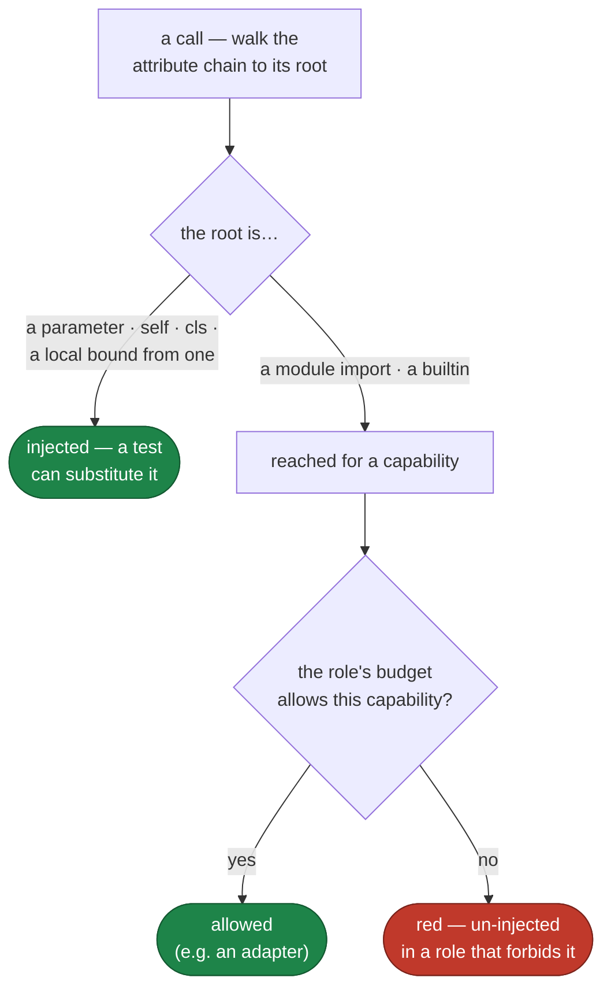

# Capabilities — the dependency-injection gate

`celebrimbor.structure.capabilities` is the sharpest application of the thesis:
**an un-injected dependency is a claim the test cannot contradict.**

A function that calls `datetime.now()` has behavior — what it does at midnight, at
a leap second, in another timezone — that no test can reach, because there is no
seam to reach it through. That is the epistemic vacuum, applied to capabilities
instead of to proofs.

## Ambient vs injected

The distinction is structural, and the AST can see it. Given a call, walk the
attribute chain to its root:

```python
def stamp(record):              def stamp(record, clock):
    record.at = now()               record.at = clock.now()
    #          ^ ambient           #          ^ injected: root `clock`
    #            unreachable       #            is a parameter
```

If the root is a **parameter** (or `self`/`cls`, or a local bound from one), the
capability was handed in — a test can substitute a different one, so the behavior
is reachable. If the root is a module-level import or a bare builtin like
`open()`, the capability was *reached for*. There is no seam.



## Budgeted by role

A capability is not universally forbidden — it has to live *somewhere*, or the
program does nothing. The role says where.

| Role | May reach for |
|---|---|
| `pure`, `normalizer`, `parser`, `orchestrator` | nothing |
| `verifier`, `producer` | filesystem |
| `presenter` | filesystem, process, environment |
| `adapter` | everything |

The shape of that table *is* the architecture. An `adapter` is the designated
boundary — the one place I/O is allowed to be ambient — and that is exactly what
makes every other role testable: adapters exist to be swapped. A `pure` callable
touching the clock is a contradiction of a declared obligation, and the gate
falsifies it.

The capabilities celebrimbor recognizes: `clock`, `random`, `filesystem`,
`network`, `environment`, `process`, `database`. The detection patterns are data,
not hidden logic — a gate whose triggers are opaque gets disabled.

## Why it is obligation

The *budget* comes from the role, so this gate needs a ratified map. Without one
there is no principled answer to "is this reach allowed here" — flag every
adapter and it is noise nobody keeps; flag nothing and it never fires. With
roles, the identical line is a violation in a `pure` callable and correct in an
`adapter`.

## Fixing a finding

```
✗ celebrimbor.structure.capabilities   1 ambient dependency use
    · myapp.stamp:label is `pure` and reaches for clock via `datetime.now`
      → inject it: take `clock` as a parameter so a test can substitute one.
        If this callable is genuinely the boundary, its role is `adapter`.
```

Two honest fixes: inject the capability (add the seam), or reclassify the
callable as what it actually is. There is no third "suppress it" that leaves the
untestable behavior in place.
