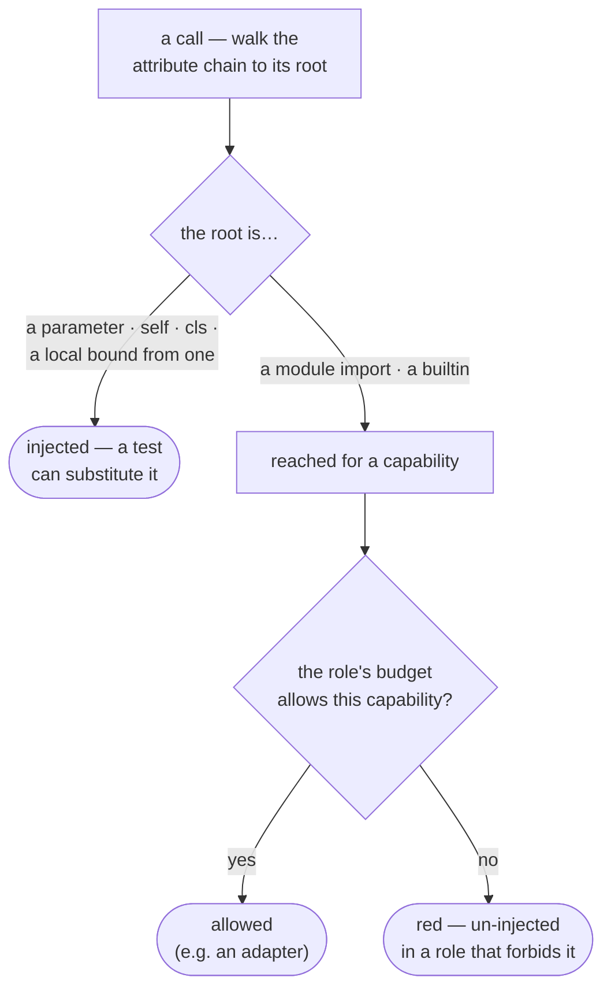

# Capabilities — the dependency-injection gate

First, the word. A **capability** is a piece of the outside world a function
reaches for: the clock, the network, files, randomness, the database. This gate,
`celebrimbor.structure.capabilities`, is the sharpest form of the whole idea
behind celebrimbor: **if a function grabs one of those things directly instead of
being handed it, no test can ever stand in its way — so no test can catch it
misbehaving.**

Think of a function that calls `datetime.now()`. What does it do at midnight? At a
leap second? In another timezone? No test can find out, because there's no seam
to slip a fake clock through. The behavior is real but unreachable — a blind spot,
right where a hidden flaw would sit.

## Ambient vs injected

There are two ways a function can get at a capability, and celebrimbor can tell
them apart just by reading the code's shape. Take any call and follow the chain of
dots back to its root name:

```python
def stamp(record):              def stamp(record, clock):
    record.at = now()               record.at = clock.now()
    #          ^ ambient           #          ^ injected: root `clock`
    #            unreachable       #            is a parameter
```

If that root is a **parameter** (or `self`/`cls`, or a local set from one), the
capability was **injected** — handed in as an argument. A test can pass in a
different one, so the behavior is reachable and checkable. If the root is instead a
module-level import or a bare builtin like `open()`, the function **reached for**
the capability itself (we also call this *ambient*). There's no seam, and no way
for a test to get in between.



## Budgeted by role

Reaching for a capability isn't banned outright — it has to happen *somewhere*, or
your program does nothing at all. The function's role decides where it's allowed.
Each role comes with a budget: the set of capabilities that job is permitted to
reach for.

| Role | May reach for |
|---|---|
| `pure`, `normalizer`, `parser`, `orchestrator` | nothing |
| `verifier`, `producer` | filesystem |
| `presenter` | filesystem, process, environment |
| `adapter` | everything |

That table *is* the architecture, in miniature. An `adapter` is the one
designated boundary — the single place a function is allowed to reach for the
outside world directly — and that is exactly what keeps every other role testable:
adapters exist precisely so a test can swap them out. A `pure` function that
touches the clock is doing something its role promised it wouldn't, so the gate
catches it.

The capabilities celebrimbor recognizes are `clock`, `random`, `filesystem`,
`network`, `environment`, `process`, and `database`. The patterns it uses to spot
them are plain data you can read, not hidden logic — a gate whose triggers you
can't inspect is a gate people turn off.

## Why it is a proving check

The budget comes from the function's role, so this gate needs the surface map to
work — the list of every public function and the job you've assigned each one.
Without that map there's no principled way to answer "is this reach allowed
here?": flag every one and it's noise nobody keeps; flag none and it never fires.
With roles in hand, the very same line of code is a violation in a `pure` function
and perfectly correct in an `adapter`.

## Fixing a finding

```
✗ celebrimbor.structure.capabilities   1 ambient dependency use
    · myapp.stamp:label is `pure` and reaches for clock via `datetime.now`
      → inject it: take `clock` as a parameter so a test can substitute one.
        If this callable is genuinely the boundary, its role is `adapter`.
```

Two honest fixes: inject the capability (add the seam so a test can substitute
one), or relabel the function as what it really is. There's no third option that
just silences the warning and leaves the untestable behavior sitting there.

## When a capability *is* the app: `ambient_capabilities`

For most apps the table above is the whole story. But some tools *are* a
capability — a file-processing utility whose entire reason to exist is reading and
writing files, or a query layer whose medium is the database. For those, forcing
every file read to be handed in turns the seam into empty ceremony: you'd be
faking the very thing the app is tested end-to-end against.

`ambient_capabilities` widens the budget for **every** role, one capability at a
time:

```toml
[tool.celebrimbor]
ambient_capabilities = ["filesystem"]
```

Now a `pure` or `parser` function may reach for the filesystem directly without
tripping the gate — but reaching for `clock`, `network`, or anything else is still
red in those roles. This still isn't a way to silence individual warnings: the
widening is per capability, applies to every function the same way (no
one-off carve-outs to rot over time), and lives in config where every run and
every reviewer can see it. Name a capability that doesn't exist and you get a hard
`ConfigError`, so a typo can't quietly switch the gate off.

Save this for the one medium you genuinely test through. The capabilities you
*can't* fake — `clock`, `network`, `random` — have behavior no test can reach,
which is the whole reason the gate wants them behind a seam in the first place;
listing one here is allowed, but it throws away the protection.
