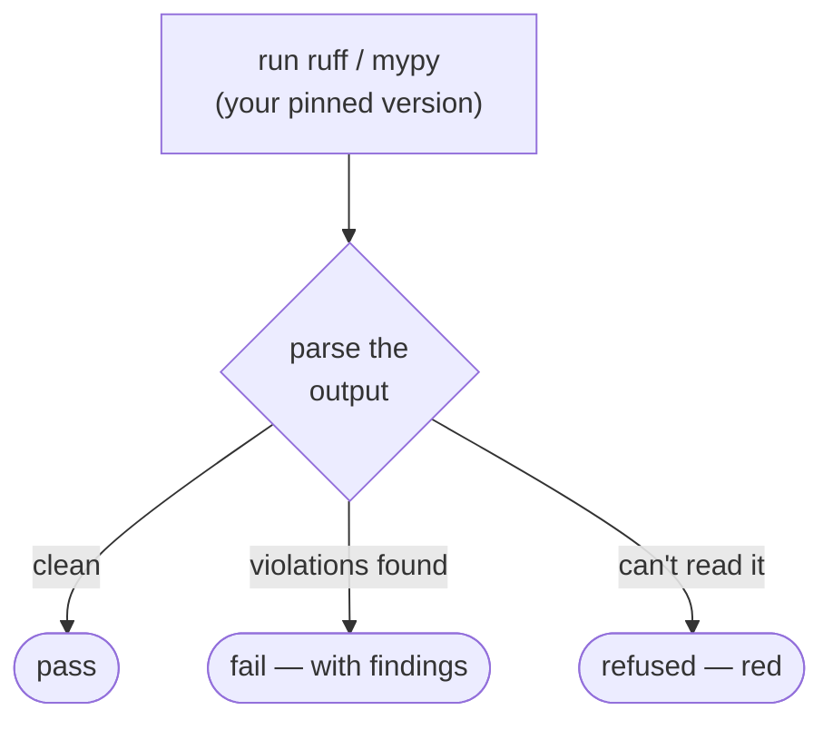

# The commodity ladder

The commodity family is the commodity ladder plus the structure gates: the checks that need no
ledger, run in seconds, and are green on a fresh repo. This is the adoption
wedge, and it is the only part of celebrimbor most projects touch on day one.

## Lint, format, types

Celebrimbor shells out to `ruff` and `mypy` — it never imports them — so the
versions that run are the ones *you* pinned. `celebrimbor init` writes a strict
default ruleset (the same one celebrimbor holds itself to).

- `celebrimbor.lint` — `ruff check`, parsed from its JSON output.
- `celebrimbor.format` — `ruff format --check`. Formatting is a *gate*, not an
  autofix: a gate that silently rewrote your tree would change what you are about
  to commit without telling you. The pre-commit hook does the rewriting.
- `celebrimbor.types` — `mypy` in strict mode.

If a tool's output cannot be parsed — a non-zero exit with unrecognized text,
usually a config error — the gate **refuses** rather than reporting clean. A tool
that told you nothing you could read has not told you all is well:

In a **trusted environment** (CI), a *missing* tool is itself a refusal — the
toolchain was promised present. On a dev box it skips with a reason, so a
contributor without mypy installed is not blocked by a gate CI will run anyway.

## Structure

These are measured directly from the AST, not delegated to a linter, so the
numbers are pinned to *your* codebase rather than to a tool's next release. On a
greenfield tree every limit is a hard ceiling; on a **legacy** tree the same
gates [ratchet](ratchets.md#structure-grandfather-the-debt-hold-the-line) —
existing breaches grandfather in and can only shrink — so you are never forced
to hand-write dozens of exemptions just to adopt.

`celebrimbor.structure.complexity` enforces per-callable and per-module budgets:

| Metric | Default |
|---|---|
| cyclomatic complexity | 10 |
| nesting depth | 4 |
| statements | 50 |
| positional parameters | 5 (excluding `self`/`cls`) |
| keyword-only parameters | 8 |
| return statements | 8 |
| function lines | 80 |
| file lines | 500 |
| public callables per module | 20 |
| domains per module | 1 |

Positional and keyword-only parameters are counted separately on purpose: a long
positional list is mis-orderable at the call site, while `f(a=1, ..., g=7)`
documents itself. Return count is generous because guard-clause style — many
early returns — is how you *avoid* deep nesting, and nesting has the stronger
justification.

The same gate also enforces **one domain per module** (it reports these under
`celebrimbor.structure.complexity`; there is no separate `cohesion` gate id). It
does *not* count classes: it builds the module's intra-reference graph
(definitions that mention each other, plus definitions that share imported
vocabulary) and counts connected components. Five classes that are about each
other are one domain; one class and an unrelated function family are two. A naive
class count would flag a cohesive value-vocabulary module and miss a genuinely
mixed one.

## Known-bad and markers

Two more commodity gates keep your *test* discipline honest — see
[Fixtures & markers](fixtures.md):

- `celebrimbor.known_bad` — every file in `tests/known-bad/` must be rejected by
  the checker it names, with the diagnostic it names.
- `celebrimbor.markers` — a test with no assertion is red; an `xfail`/`skip` must
  cite a reason.
