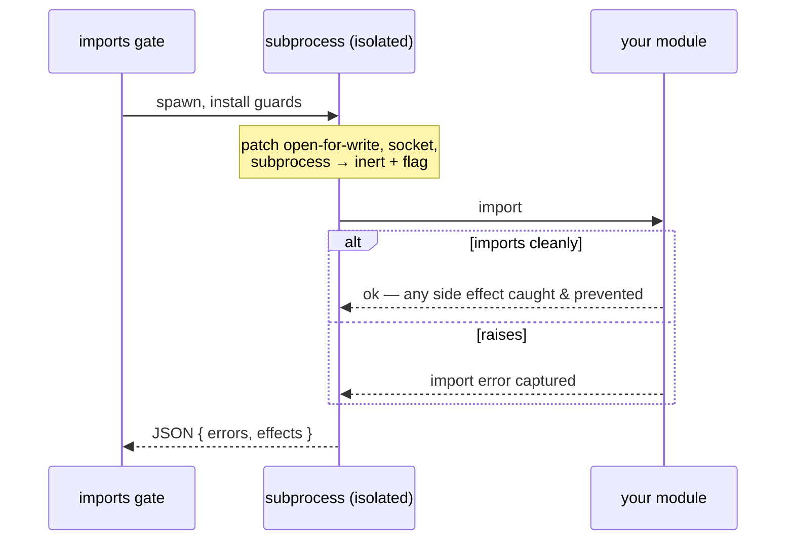

# Fixtures & markers

Two of the everyday checks (the ordinary ones every project wants) keep your
*test* discipline honest — because a test suite is only trustworthy if the tests
can actually fail.

## Known-bad provenance

`tests/known-bad/` is a directory of files that are *deliberately wrong*. Each one
is a falsifier for a checker — a way that checker could be caught being wrong, kept
on hand as proof that it still rejects what it's supposed to reject. A linter
nobody has ever seen reject anything is a linter nobody should trust.

`celebrimbor.known_bad` audits that directory strictly, in three ways:

- **Orphans, both directions.** A file with no `expected.yaml` entry is an orphan
  (nobody knows what it's meant to prove); an entry naming a file that doesn't
  exist is a stale claim. Both are red.
- **The *right* checker.** "Something complained" is perfectly consistent with the
  exact rule you care about having been silently switched off. So the entry names
  which checker must reject the file.
- **The *expected* diagnostic.** Not just rejection, but rejection with the named
  error code — a file can be wrong in several ways at once, and only one of them is
  the point.

```yaml
# tests/known-bad/expected.yaml
unused_import.py:
  checker: ruff
  diagnostic: F401
  why: proves the unused-import rule is actually enabled
```

The gate runs the named checker (isolated from your project config, so a per-file
ignore can't hide the rule) and confirms the diagnostic fires.

`ruff` and `mypy` are built-in shorthands, but the gate isn't limited to them. An
app with its own domain-specific linter declares how to run it, and its known-bad
fixtures get the same three guarantees. There are two ways to run a checker, and
two ways to match its output:

**As a subprocess** — a command template with a `{file}` placeholder:

```toml
[tool.celebrimbor.known_bad_checkers.style_audit]
command = "python -m myapp.style_audit {file}"   # {file} = the fixture path
pattern = "^([A-Z-]+)"                            # first group = the diagnostic code
```

**In-process** — a `module:function` that takes the fixture path and returns the
diagnostics it produced, for a checker with no clean per-file subprocess entry (a
book-context-bound editorial linter, say). celebrimbor imports and calls it:

```toml
[tool.celebrimbor.known_bad_checkers.style_audit]
callable = "myapp.editorial:diagnostics_for"     # def diagnostics_for(path) -> list[str]
match = "substring"
```

**`match`** is `exact` by default: the declared diagnostic has to be an exact
element of what the checker emits — right for stable error codes. Set `substring`
when the linter emits human phrases with a variable part, and the fixture passes
when its declared phrase turns up *inside* some emitted line:

```
em_dash.md:4: sentence break uses an em dash   ← emitted
diagnostic: "uses an em dash"                  ← declared, matched as a substring
```

Either way, the gate confirms the expected diagnostic fires. A checker that won't
run — a command that's missing, a callable that won't import, a checker that
raises — is *unverifiable*, so it goes red, never a quiet pass. This is what lets
an app retire its own hand-rolled fixture-provenance auditor and lean on
celebrimbor instead.

## Marker grammar

`celebrimbor.markers` makes sure a test's markers mean something you can check —
this is where quiet dishonesty tends to pile up:

- **A test must assert.** A test with no `assert`, no `pytest.raises`, and no
  `self.assert*` can't fail, so it proves nothing. Rejected.
- **An `xfail` must cite a reason.** `@pytest.mark.xfail` with no `reason=` is
  undocumented debt nobody will circle back to.
- **A `skip` must name its condition.** `@pytest.mark.skipif` needs a reason; a
  bare `skip` needs one too.

celebrimbor's own test suite obeys this grammar. The check reads the code's
structure (its AST) rather than running it, so it catches an empty test without
executing your suite.

### Citing limitations

By default an `xfail` or `skip` need only *have* a reason. You can opt into more:

```toml
[tool.celebrimbor]
markers_cite_limitations = true
```

Now the reason has to **cite a limitation declared in the invariant ledger** — one
of the `limitations:` ids on your invariants. That's the difference between a
*known gap* (catalogued, reviewable debt tied to a real promise) and a shrug:

```python
@pytest.mark.skip(reason="soft-deleted-customers: not handled until v2")  # cites a limitation → ok
@pytest.mark.skip(reason="flaky, will look later")                        # a shrug → red
```

It fails closed: turn it on with no invariant ledger, or no `limitations`
declared, and the gate refuses rather than reddening every reason you have — there
is nothing to cite yet, so the flag can't mean anything.

## Import health (opt-in)

`celebrimbor.imports` is the one gate that actually *imports* your application.
Everything else reads your code's structure without running it — deliberately, so
that the guarantee "every function is accounted for" can never fall behind code
that fails to import. This check chooses to import, and it does so in an
**isolated subprocess**, on the far side of a boundary the code inventory never
crosses. It's **opt-in** (`import_check = true`), off by default, because it runs
your code.

When it's on, it reports two things reading the structure alone can't see:

- **A module that won't import** — an import-time `NameError`, a missing optional
  dependency, a circular import that only bites when the module loads.
- **An import-time side effect** — a module that writes a file, opens a socket, or
  spawns a process *while it's being imported*. The probe installs guards before
  importing, so it both spots the effect and *prevents* it: a module that would
  write a file on import does not actually write one during the check.



It's *opt-in within the proving checks*: the ledger-based proving checks skip
until you write their ledger, but this one skips until you flip `import_check =
true` — because importing your code is a choice only you can make.

## Utilities

A few supporting utilities ship in the package for your own tests to import (they
are not gates):

- **`celebrimbor.scenarios.pairwise`** — deterministic all-pairs scenario
  generation. Most interaction bugs are triggered by just two values interacting,
  so pairwise covers every value-pair across all your parameters in a fraction of
  the cases. It's deterministic (no random numbers) so a failing scenario is
  reproducible and a committed baseline actually means something, and
  `uncovered_pairs()` lets you *prove* completeness. `cartesian()` is there too,
  for when you genuinely need the full product.
- **`celebrimbor.differ`** — a snapshot differ that stays stable across toolchain
  versions, with a reason-gated update and a `self_proof()` that mutates a baseline
  in memory to confirm the differ actually detects a change (a differ never shown
  to detect a change is a blind differ). Its `Normalizer` masks volatile tokens —
  timestamps, temp paths, addresses — so a snapshot compares on what matters
  rather than on noise.
