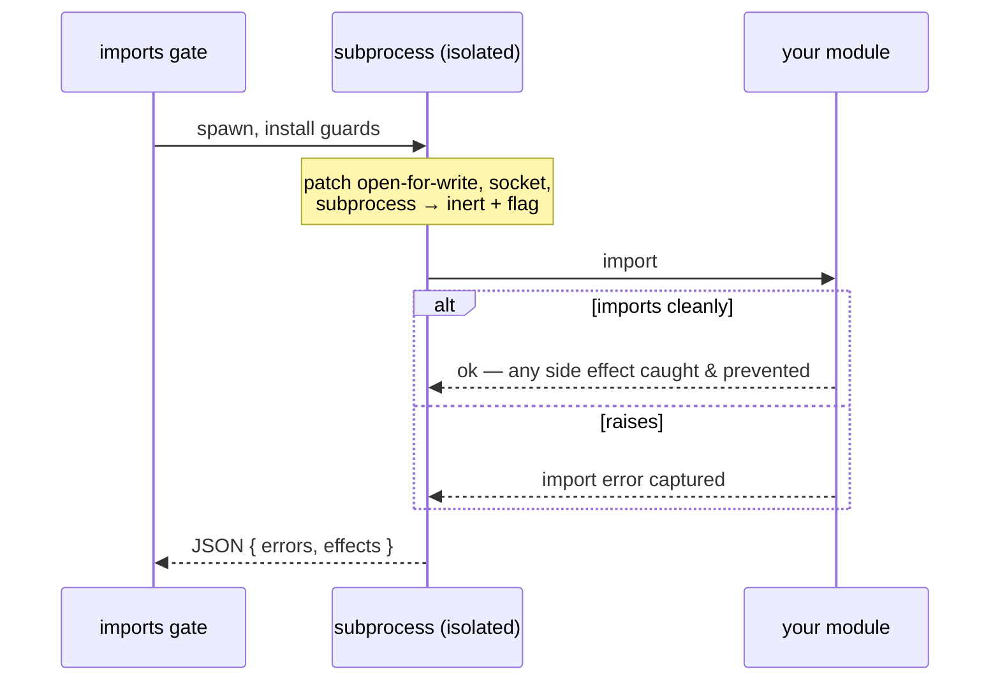

# Fixtures & markers

Two commodity gates keep your *test* discipline honest — because a test suite is
only trustworthy if the tests can actually fail.

## Known-bad provenance

`tests/known-bad/` is a directory of files that are *deliberately wrong*, each
one a falsifier for a checker: proof that the checker still rejects what it is
supposed to. A linter that has never been observed to reject anything is a linter
nobody should trust.

`celebrimbor.known_bad` audits it strictly, in three ways:

- **Orphans, both directions.** A file with no `expected.yaml` entry is an orphan
  (nobody knows what it proves); an entry naming a file that does not exist is a
  stale claim. Both are red.
- **The *right* checker.** "Something complained" is compatible with the exact
  rule you care about having been silently disabled. The entry names which
  checker must reject the file.
- **The *expected* diagnostic.** Not just rejection, but rejection with the named
  code — a file can be wrong several ways at once, and only one is the point.

```yaml
# tests/known-bad/expected.yaml
unused_import.py:
  checker: ruff
  diagnostic: F401
  why: proves the unused-import rule is actually enabled
```

The gate runs the named checker (isolated from project config, so a per-file
ignore does not hide the rule) and confirms the diagnostic fires.

`ruff` and `mypy` are built-in shorthands, but the gate is not limited to them.
An app with its own domain linter declares how to run it, and its known-bad
fixtures get the same three guarantees. There are two ways to run it, and two
ways to match:

**As a subprocess** — a command template with a `{file}` placeholder:

```toml
[tool.celebrimbor.known_bad_checkers.style_audit]
command = "python -m myapp.style_audit {file}"   # {file} = the fixture path
pattern = "^([A-Z-]+)"                            # first group = the diagnostic code
```

**In-process** — a `module:function` that takes the fixture path and returns the
diagnostics it produces, for a checker with no clean per-file subprocess entry (a
book-context-bound editorial linter, say). celebrimbor imports and calls it:

```toml
[tool.celebrimbor.known_bad_checkers.style_audit]
callable = "myapp.editorial:diagnostics_for"     # def diagnostics_for(path) -> list[str]
match = "substring"
```

**`match`** is `exact` by default (the declared diagnostic is an exact element of
what the checker emits — right for stable codes). Set `substring` when the linter
emits human phrases with a variable part, and the fixture passes when its declared
phrase appears *inside* some emitted line:

```
em_dash.md:4: sentence break uses an em dash   ← emitted
diagnostic: "uses an em dash"                  ← declared, matched as a substring
```

Either way, the gate confirms the expected diagnostic fires; a checker that will
not run — a command that is absent, a callable that will not import, a checker
that raises — is *unverifiable* (red), never a quiet pass. This is what lets an
app retire its own hand-rolled fixture-provenance auditor and lean on celebrimbor
instead.

## Marker grammar

`celebrimbor.markers` enforces that a test's markers mean something checkable —
this is where quiet dishonesty accumulates:

- **A test must assert.** A test with no `assert`, no `pytest.raises`, no
  `self.assert*` cannot fail, so it proves nothing. Rejected.
- **An `xfail` must cite a reason.** `@pytest.mark.xfail` with no `reason=` is
  undocumented debt nobody will revisit.
- **A `skip` must name its condition.** `@pytest.mark.skipif` needs a reason; a
  bare `skip` needs one too.

Celebrimbor's own test suite obeys this grammar. The check is AST-based, so it
does not need to run your tests to catch a vacuous one.

## Import health (opt-in)

`celebrimbor.imports` is the one gate that *imports* your application. Everything
else is AST-only — deliberately, so the completeness guarantee can never fall
behind code that fails to import. This check chooses to import, and does so in an
**isolated subprocess** on the far side of a boundary the AST inventory never
crosses. It is **opt-in** (`import_check = true`), off by default, because it
runs your code.

When on, it reports two things the AST cannot see:

- **A module that does not import** — an import-time `NameError`, a missing
  optional dependency, a circular import that only bites at import time.
- **An import-time side effect** — a module that writes a file, opens a socket,
  or spawns a process *while importing*. The probe installs guards before
  importing, so it both detects the effect and *prevents* it: a module that
  would write a file on import does not actually write one during the check.



It is *opt-in within the obligation family*: unlike the ledger-keyed obligation
gates, which skip until you author their ledger, this one skips until you flip
`import_check = true` — because importing your code is a choice only you can make.

## Utilities

Supporting utilities ship in the package for your own tests to import (they are
not gates):

- **`celebrimbor.scenarios.pairwise`** — deterministic all-pairs scenario
  generation. Most interaction bugs are triggered by two values; pairwise covers
  every value-pair across all parameters in a fraction of the cases. It is
  deterministic (no RNG) so a failing scenario is reproducible and a committed
  baseline is meaningful, and `uncovered_pairs()` lets you *prove* completeness.
  `cartesian()` is there too when you genuinely need the full product.
- **`celebrimbor.differ`** — a toolchain-stable snapshot differ with a
  reason-gated update and a `self_proof()` that mutates a baseline in memory to
  confirm the differ actually detects a change (a differ never shown to detect a
  change is a blind differ). Its `Normalizer` masks volatile tokens — timestamps,
  temp paths, addresses — so a snapshot compares on what matters, not on noise.
