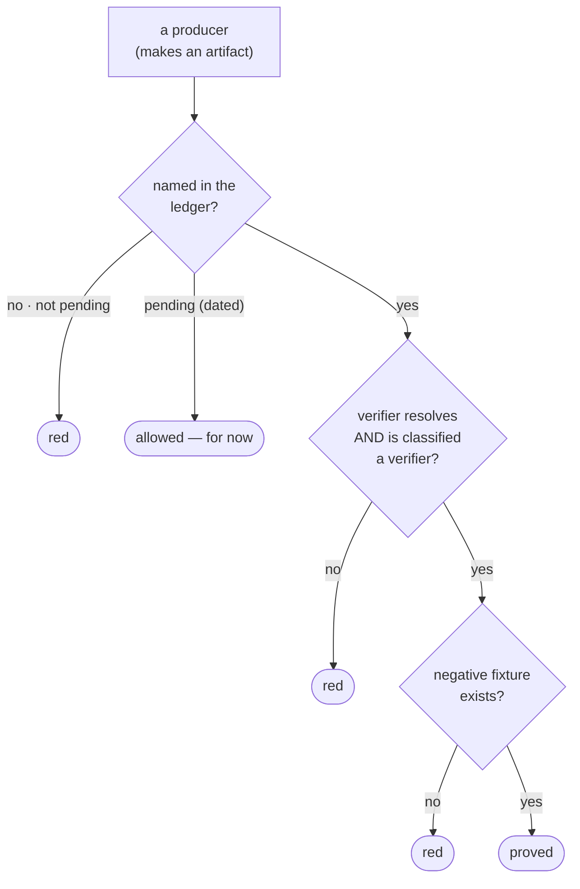
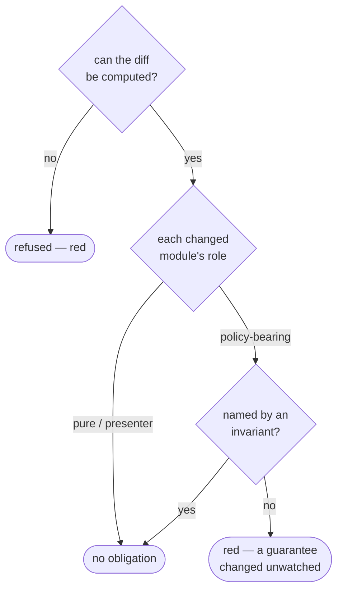

# Ledgers

Three obligation gates read declarative ledgers and validate them for *referential
integrity* against the code — not merely parsing them, but checking every
reference resolves and failing on drift. A ledger that can fall out of step with
the code without anyone noticing is a ledger nobody trusts.

## Producers — the no-blind-verifier gate

`celebrimbor.producers` enforces one rule: **you cannot inherit a verifier that
inspects nothing.** A `producer` makes an artifact, and the only thing that makes
an artifact trustworthy is a verifier that would go red if the artifact were
wrong. So every producer must name, on the record:

- the `verifier` that inspects its artifact, and
- a `negative_fixture` — a test proving that verifier turns red on a bad artifact.

```yaml
# .celebrimbor/producers.yaml
version: 1
producers:
  myapp.render:
    verifier: myapp.verify:verify_summary
    negative_fixture: tests/negative/test_render.py::test_empty_summary_caught
pending:
  myapp.export:
    reason: verifier not written yet
    review_by: 2026-09-01
```

The gate checks the verifier resolves to a real callable *classified as a
verifier*, and the fixture exists. A producer with no entry can sit in `pending`
— but visibly, with a review date, on an allowlist that expires.



!!! note "Override granularity"
    The producers it demands entries for come from the module default *plus*
    per-callable overrides — so a `producer` introduced by a single override on
    an otherwise `pure` module is caught. Missing that would make the cheapest
    way to ship an unchecked artifact a one-line override.

## Invariants

`celebrimbor.invariants` validates a ledger of the promises your system makes:

```yaml
# .celebrimbor/invariants.yaml
version: 1
invariants:
  order-has-customer:
    statement: every order references an existing customer
    enforced_by: myapp.orders:validate_order
    critical: true
    negative_proof:                       # one, or several — each is checked
      - tests/negative/test_orders.py::test_orphan_order_rejected
      - tests/negative/test_orders.py::test_deleted_customer_rejected
    limitations:                          # what the promise knowingly does NOT cover
      - soft-deleted-customers
  slug-is-unique:
    statement: no two posts share a slug
    enforced_by: myapp.posts:check_slug_unique
```

Every named `enforced_by` must resolve to a real callable, and every `critical`
invariant must keep a real `negative_proof`. A promise whose enforcer has been
renamed or deleted turns the gate red — a promise nobody enforces is not a
promise.

`negative_proof` may be a single string or a **list** — an invariant can be
falsified several independent ways, and each named proof must exist (a
named-but-deleted proof is drift, just like a renamed enforcer). `limitations`
records the cases the promise deliberately does not cover — declared, reviewable
debt — and, with [`markers_cite_limitations`](fixtures.md#citing-limitations),
becomes the vocabulary a suppressed test must cite.

This is the producer ledger generalized: a producer ledger is an invariant
ledger specialized to "the artifact is correct."

!!! tip "Docs that cannot lie"
    The invariant ledger renders to human-readable markdown — a living list of
    the promises your system makes. It cannot drift into fiction, because the
    gate has already checked every line of it against the code. Documentation
    validated by a gate is the only documentation that stays true.

## The impact gate

`celebrimbor.impact` reads the invariant ledger *differentially*, against a git
diff. It asks a question about *change*: when you modify a module that decides or
attests something — a verifier, producer, parser, normalizer, or adapter — is
there a recorded promise governing it?



A changed [policy-role](../concepts/roles.md#policy-roles-and-the-impact-gate)
module with no invariant naming it as an enforcer is the gap, and it reddens.
The policy roles are `parser`, `normalizer`, `verifier`, `producer`, `adapter`,
and `orchestrator` by default; set `policy_roles` in config to match an existing
harness's set. This surfaces the silent alteration of a guarantee, made in a
place with no invariant watching it.

!!! important "Fail closed on an unknowable diff"
    If the changed-file set cannot be determined — not a repo, git absent, an
    unresolvable base — the gate **refuses**. It does not treat "I could not tell
    what changed" as "nothing changed", because that is the estimate that lets a
    policy change slip through on the one run where git was unhappy.
