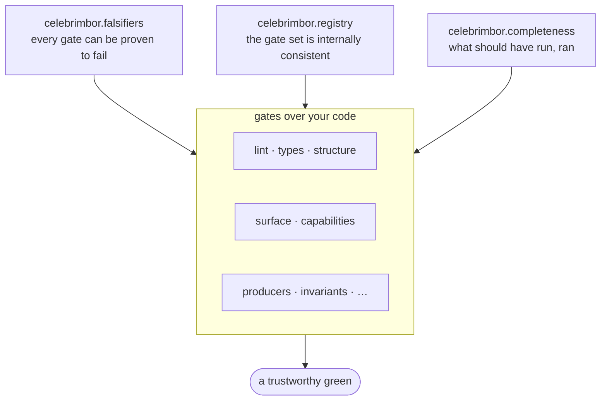

# The gates on the gates

Three of celebrimbor's twenty checks do not check *your* code. They check the
gate itself. They are the answer to the oldest problem in quality tooling: **who
checks the checker?** If a gate can silently disappear, misfile its result, or
ship with no way to fail, then every green it ever produced is suspect.

These three run in the `commodity` family, at the `fast` stage, on every project
— because the guarantee they provide is the one thing that must never be opt-in.

## `celebrimbor.falsifiers` — no blind gates

A gate that has never been observed to turn red is a blind gate, and a blind
gate manufactures confidence. So **every `@check` must name a `falsified_by`** —
a test, fixture, or dated admission — and this gate proves each one resolves to
something real. The obligation is enforced twice: the decorator refuses a check
with no falsifier at registration time, and this gate keeps the promise honest
over time (a `falsified_by` pointing at a test that was deleted goes red).

The escape valve is explicit and dated: `falsified_by=Unproven("reason",
review_by="2026-09-01")` records that no falsifier exists *yet* — visible in
every run, and red once the review date passes. Debt with a deadline, never debt
in silence.

## `celebrimbor.registry` — the gate set is coherent

The registry is the single source of truth for "what checks exist." This gate
holds it consistent: check ids are unique (two checks sharing an id would let one
silently shadow the other, since ids are how results are addressed), and every
check carries a title and a well-formed id. A duplicate id is rejected outright.

## `celebrimbor.completeness` — what should have run, ran

This is the terminal check, and it is where the regress stops. It compares the
accumulated report against the registry: every check that should have run at this
stage is present, nothing ran that the registry does not know about (a *stray*
result would mean results are being manufactured outside the registry), and
**the report is not empty** — a gate that ran zero checks proved nothing, and
reporting green for it is exactly the plausible-but-wrong outcome celebrimbor
exists to prevent.

It must run last, because it inspects everything that ran before it. If the
terminal check itself did not run, nothing would report that it didn't — so that
one final link is closed by a static assertion in celebrimbor's own test suite,
the one place checking the checker needs no further checker.

!!! note "Why this matters more than it looks"
    Registration happens by import side effect. A check in a module nobody
    imports is a check that silently never runs — a gate quietly disappearing,
    which is the exact failure mode this whole project exists to prevent,
    occurring *inside the tool meant to prevent it*. These three gates, plus a
    meta-test that walks the package on disk, are what make "20 checks ran"
    a fact rather than a hope.

→ See [celebrimbor on celebrimbor](../concepts/self-hosting.md) for these gates
turned on celebrimbor's own source.
