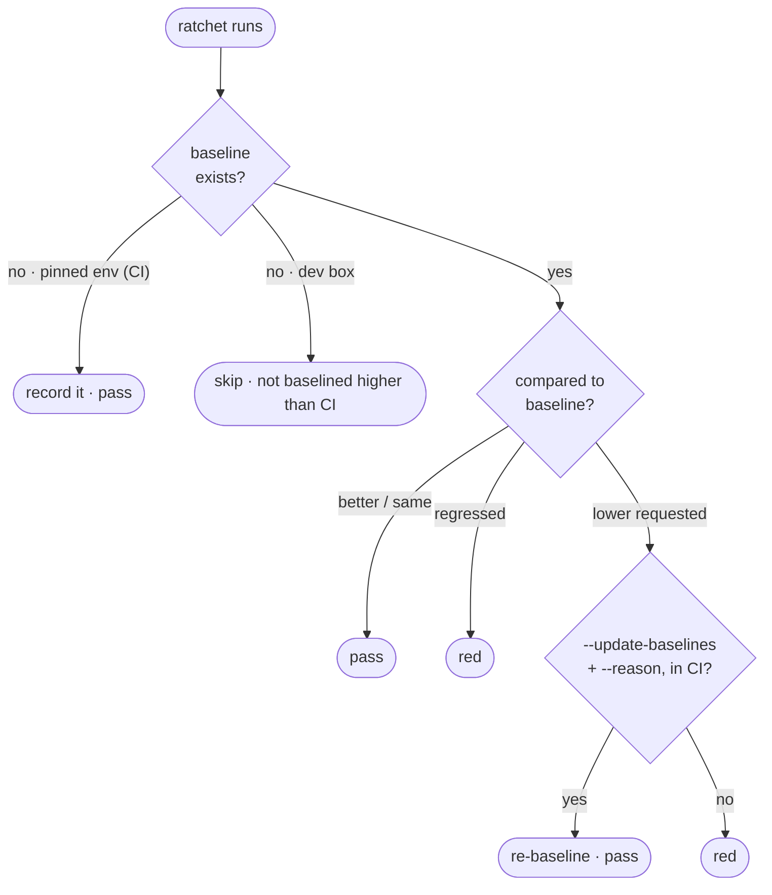

# Ratchets

A ratchet is a one-way gate. It's a number (or a set of them) recorded once,
committed to the repo, and from then on allowed to move in one direction only:
it can improve, but it can't quietly slip backward without someone signing off.
The number is measured in the *pinned* environment — the one locked-down setup,
usually CI, that every run is held to, so a reading taken there means the same
thing every time. celebrimbor has **three** ratchets — coverage, mutation, and
structure — and three rules hold across all of them, each one learned the hard
way:

- **Baseline only in the pinned environment.** A dev box measures differently
  than CI, so a baseline taken on a dev box hands you a red CI on day two. The
  baseline records where it was taken, and the write path refuses a dev box.
- **No silent lowering.** The only way a floor moves down is
  `--update-baselines --reason "..."`, run in CI. There is no local path that
  quietly weakens a ratchet.
- **A weak floor is not a green floor.** A floor recorded below the configured
  minimum (`min_coverage_floor`, default `60.0`) stays red until a human writes
  down why — that's the low-floor meta-ratchet — so auto-baselining can't freeze
  poor coverage in place and call it green.

Here's the decision every ratchet makes on each run:



## Coverage

`celebrimbor.coverage` (PR stage) holds a per-module coverage floor that may only
rise. On the **first run in CI** with no baseline, it records the current numbers
and passes — this is what stops an existing repo from going red on day two. Every
run after that ratchets against those numbers.

It reads a `.coverage` data file your test run already produced, so the gate
measures coverage — it does not run your suite. The comparison is a plain function
of two dicts, so you can test its logic without running coverage at all.

```yaml
# .celebrimbor/baselines/coverage.yaml — committed
version: 1
environment: ci
floors:
  myapp.parsing: 95.0
  myapp.store: 80.0
reasons:
  myapp.store: "legacy module, ratcheting up incrementally"
```

To lower a floor, or to accept new code below the minimum, run `celebrimbor gate
--update-baselines --reason "..."` in CI. A drop with no reason is refused.

## Mutation — survivor identity, not count

`celebrimbor.mutation` (release stage) is the distinctive one. A mutation run
seeds deliberate bugs into your code and reports which ones your test suite failed
to catch — the *survivors*. The obvious ratchet just counts survivors and demands
the number not grow. **That misses the failure that matters:** a survivor set that
swaps out members while keeping the same size. Twelve survivors last week, twelve
this week — but three are new ones, in code that used to be covered. The count
says all is well, and a regression just shipped.

So this ratchet tracks *which* mutants survive, by identity
(`file:line:operator` — stable across tool runs), and reddens on any survivor that
wasn't in the baseline. A survivor that disappears is progress; a survivor that
appears is a hole that just opened. Only the second is a regression, and the count
can't tell the two apart.

```yaml
# .celebrimbor/baselines/mutation.yaml — committed
version: 1
environment: ci
survivors:
  - src/myapp/parse.py:42:and->or
  - src/myapp/parse.py:88:+->-
```

Accepting a *new* survivor into the baseline is admitting the suite got weaker
somewhere, so `--update-baselines` requires a reason. Dropping survivors you've
since killed is always free.

The ratchet is separate from *where the survivors come from*. `mutmut` is the
default runner (`mutation_tool`), but an app with its own deterministic mutation —
a curated set of AST operators over its policy modules, say — can supply the
survivors directly and skip the tool entirely:

```toml
[tool.celebrimbor]
mutation_survivors = "myapp.mutation:survivors"   # -> frozenset[celebrimbor.Survivor]
```

celebrimbor imports and calls it (`from celebrimbor import Survivor` to build the
set), then runs the *same* survivor-identity ratchet over the result — baseline,
compare, reason-gated update. A source that won't import, or that returns
something other than `Survivor`s, is refused (red), never a quiet pass.

Why identity beats count — same size, different members, and only the second run
is a regression:

| Survivor | Baseline (2) | This run (2) | |
|---|:--:|:--:|---|
| `parse.py:42 and→or` | ✓ | ✓ | unchanged |
| `parse.py:88 +→-` | ✓ | — | killed — progress |
| `store.py:15 <→<=` | — | ✓ | **NEW — a hole opened, red** |

The count is 2 both weeks; the *identity* check is what catches the new survivor
the count hides.

## Structure — grandfather the debt, hold the line

The [structure gates](commodity.md) (complexity, nesting, length, cohesion,
capability budgets) look like hard limits, but on a real legacy repo they act as
the third ratchet. Point celebrimbor at a codebase with 136 breaches and a strict
gate is useless: nobody hand-writes 136 exemptions, so they just switch the gate
off. Instead, the first run in CI **grandfathers** the existing breaches into a
structure baseline, and from then on the gate reddens only on a *new or worsened*
breach. New code stays strict; the legacy debt is frozen — not waived — and can
only shrink.

```yaml
# .celebrimbor/baselines/structure.yaml — committed
version: 1
environment: ci
breaches:
  "myapp.report:build": {complexity: 14}      # grandfathered; must not climb
  "myapp.legacy:load":  {function_lines: 120}
```

There's one deliberate difference from coverage: structure **does not
auto-baseline** on its first run the way coverage does. A coverage floor is a
relative measure, so a first reading is a fair starting line; a complexity limit
is an *absolute rule* (`≤ 10` is a rule, not a reading), so grandfathering
existing debt is an explicit, reason-gated act — `celebrimbor gate
--update-baselines --reason "adopting on a legacy tree"` — never something that
happens quietly. See [Adopting an existing app](../guides/adoption.md) for the
full path.
