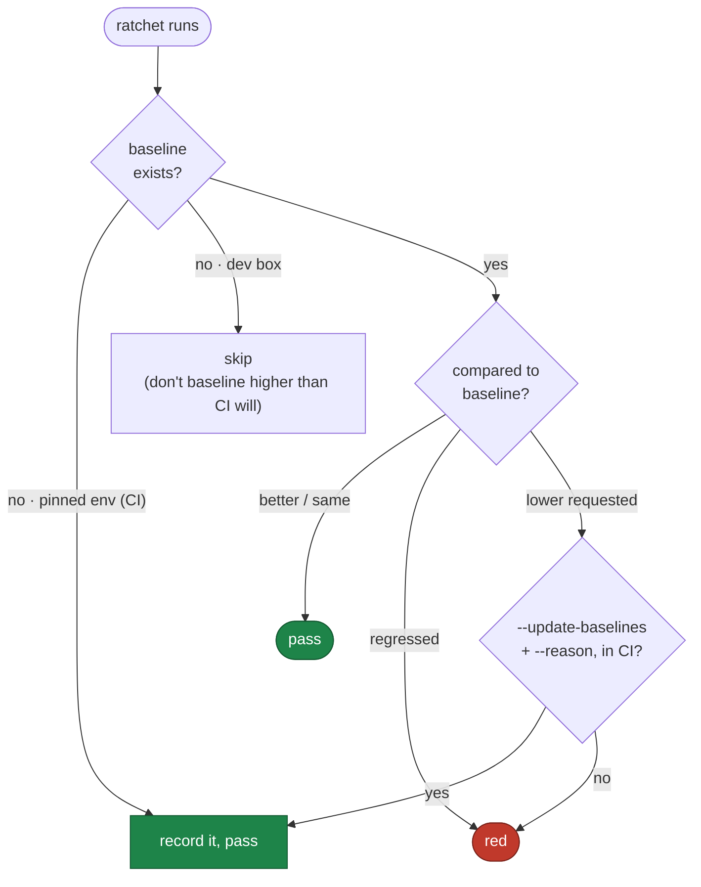
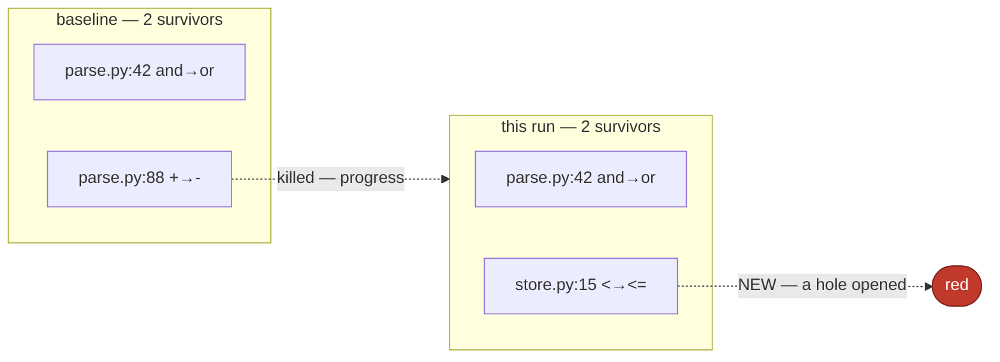

# Ratchets

A ratchet is a number (or a set) recorded in the pinned environment, committed to
the repo, and thereafter allowed to move in one direction only. There are
**three** — coverage, mutation, and structure — and three rules hold across all
of them, each hard-won:

- **Baseline only in the pinned environment.** A dev box measures differently
  than CI, so a dev-box baseline hands you a red CI on day two. The baseline
  records where it was taken, and the write path refuses a dev box.
- **No silent lowering.** The only way a floor moves down is
  `--update-baselines --reason "..."`, in CI. There is no local path that
  quietly weakens a ratchet.
- **A weak floor is not a green floor.** A floor recorded below the configured
  minimum (`min_coverage_floor`, default `60.0`) is red until a human writes why
  — the low-floor meta-ratchet — so auto-baselining cannot freeze poor coverage
  as false green.

The decision every ratchet makes on each run:



## Coverage

`celebrimbor.coverage` (PR stage) enforces a per-module coverage floor that may
only rise. On the **first run in CI** with no baseline, it records the current
numbers and passes — this closes the "existing repo goes red on day two" gap.
Every run after ratchets against them.

It reads an existing `.coverage` data file (your test run produces it), so the
gate measures — it does not run your suite. The comparison is a pure function of
two dicts, so its logic is testable without running coverage at all.

```yaml
# .celebrimbor/baselines/coverage.yaml — committed
version: 1
environment: ci
floors:
  myapp.parsing: 95.0
  myapp.store: 80.0
reasons:
  myapp.store: "legacy module, ratcheting up incrementally"
```

To lower a floor or accept new code below the minimum, `celebrimbor gate
--update-baselines --reason "..."` in CI. A drop without a reason is refused.

## Mutation — survivor identity, not count

`celebrimbor.mutation` (release stage) is the distinctive one. A mutation run seeds
deliberate bugs and reports which the suite failed to catch — the *survivors*.
The naive ratchet tracks how many survive and demands the number not grow. **That
misses the failure that matters:** a survivor set that changes members while
keeping the same size. Twelve survivors last week, twelve this week, but three
are new ones in code that used to be covered — the count says all is well, and a
regression shipped.

So this ratchet tracks *which* mutants survive, by identity (`file:line:operator`
— stable across tool runs), and reddens on any survivor that was not in the
baseline. A survivor that disappears is progress; a survivor that appears is a
hole that opened. Only the second is a regression, and the count cannot tell them
apart.

```yaml
# .celebrimbor/baselines/mutation.yaml — committed
version: 1
environment: ci
survivors:
  - src/myapp/parse.py:42:and->or
  - src/myapp/parse.py:88:+->-
```

Accepting a *new* survivor into the baseline is admitting the suite got weaker
somewhere, so `--update-baselines` requires a reason. Dropping resolved survivors
is always free. The mutation runner itself is configurable (`mutation_tool`,
default `mutmut`).

Why identity beats count, in one picture — same size, different members:



## Structure — grandfather the debt, hold the line

The [structure gates](commodity.md) (complexity, nesting, length, cohesion,
capability budgets) look like hard limits, but on a real legacy repo they are the
third ratchet. Point celebrimbor at a 136-breach codebase and a strict gate is
useless: nobody hand-writes 136 exemptions, so they turn the gate off. Instead,
the first run in CI **grandfathers** the existing breaches into a structure
baseline, and the gate thereafter reddens only on a *new or worsened* breach.
Greenfield code stays strict; the legacy debt is frozen, not waived, and can only
shrink.

```yaml
# .celebrimbor/baselines/structure.yaml — committed
version: 1
environment: ci
breaches:
  "myapp.report:build": {complexity: 14}      # grandfathered; must not climb
  "myapp.legacy:load":  {function_lines: 120}
```

One deliberate asymmetry with coverage: structure **does not auto-baseline** on
the first run the way coverage does. A coverage floor is a relative measure, so a
first reading is a fair starting point; a complexity limit is an *absolute rule*
(`≤ 10` is a rule, not a reading), so grandfathering existing debt is an explicit,
reason-gated act — `celebrimbor gate --update-baselines --reason "adopting on a
legacy tree"` — never something that happens quietly. See
[Adopting an existing app](../guides/adoption.md) for the full path.
