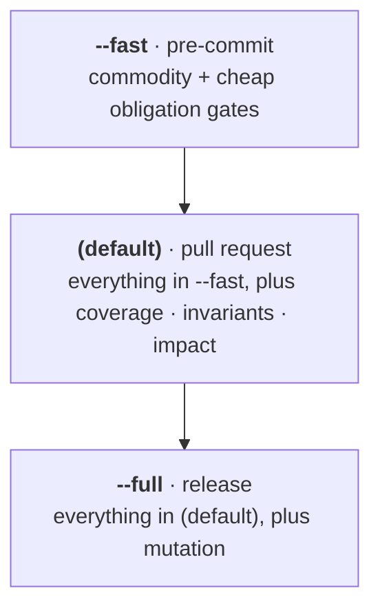

# Stages and families

`celebrimbor gate` is one command. Two separate things decide what it runs, and
it helps to keep them apart. One is *how deep this particular run goes*; we call
that the **stage**. The other is *what kind of check each one is*; we call that
the **family**.

| Axis | Question | Values | Where it lives |
|---|---|---|---|
| **Stage** | *How deep should this run go?* | `fast` → `default` → `full` | the `--fast` / `--full` flags |
| **Family** | *What kind of check is this?* | `commodity` / `obligation` | a property of each check |

The two are different in kind, which is why they get different words. **Stage is
a scale** — `fast` fits inside `default` fits inside `full`, and you could
imagine an even deeper fourth stage someday. **Family is a yes-or-no split** — a
check either needs a file of promises you wrote by hand (`obligation`) or it
doesn't (`commodity`). There's no middle ground and no third answer, so there are
exactly two families, always. That's also why they aren't numbered: `0`/`1`/`2`…
would hint at a sequence that could grow, and this one never will.

Every check carries one value of each. The `invariants` check, for example, is
in the `obligation` family and runs at the `default` stage. Family describes the
check itself; stage describes the run it lands in.

!!! note "check vs. gate"
    A **check** is one registered unit (`@check`, one line of gate output). Each
    check can stop the run — that makes it a **gate** too — so the two words
    name the same thing. "The gate" (singular) is all of them run together.

## The stage axis — how deep a run goes

Pick a stage and you run every check assigned to it *plus every cheaper one*, so
the stages nest: `full` contains `default`, which contains `fast`.

```bash
celebrimbor gate --fast    # fast stage    — pre-commit    — target < ~10s
celebrimbor gate           # default stage — pull request  — target < ~2min
celebrimbor gate --full    # full stage    — merge/release — as slow as it must be
```

Because each stage contains the cheaper one, nothing you ran at pre-commit gets
skipped later:



## The family axis — what kind of check

- **`commodity` — the everyday checks.** Lint, types, formatting, structure,
  known-bad, marker grammar: the ordinary checks nearly every project wants,
  set up for you with good defaults. They need nothing from you and pass on a
  fresh repo, which is why they're the easy way in.
- **`obligation` — the proving checks.** Surface roles, capabilities, producers,
  invariants, impact, ratchets, imports: the deeper checks that make your code
  prove it's what it claims. Each one *skips with a reason* until you write the
  file of promises it reads, so none of them turns your first day red. You opt
  in when you're ready.

## Every check, on both axes

| Check | Stage | Family | What it enforces |
|---|---|---|---|
| `lint` / `format` / `types` | fast | commodity | ruff + mypy, strict, shelled out |
| `structure.complexity` | fast | commodity | complexity, nesting, length, param budgets — **and** one-domain-per-module cohesion |
| `structure.capabilities` | fast | obligation | dependencies injected, budgeted by role |
| `surface.completeness` | fast | obligation | every public callable is in a ratified map |
| `surface.naming` | fast | obligation | a callable named for a stronger role than assigned |
| `surface.evidence` | fast | obligation | a declared role the code contradicts |
| `surface.pin` | fast | obligation | a ratified role still describes the code |
| `known_bad` | fast | commodity | every known-bad file is rejected as declared |
| `markers` | fast | commodity | a marked test asserts; xfail/skip cite a reason |
| `falsifiers` / `registry` / `completeness` | fast | commodity | the gates on the gates |
| `producers` | default | obligation | no blind verifiers |
| `invariants` | default | obligation | every enforcer resolves; criticals keep a proof |
| `impact` | default | obligation | a changed policy-role module is named by an invariant |
| `imports` | default | obligation | modules import clean, no import-time effects |
| `coverage` | default | obligation | per-module coverage only rises |
| `mutation` | full | obligation | no new mutant survives (survivor identity) |

## Reading the output

```
celebrimbor gate — fast stage

  ✓ celebrimbor.lint            ruff reports no violations
  ✗ celebrimbor.structure.complexity   1 breach
      · myapp.report:build — cyclomatic complexity is 14 (limit 10)
        → extract the branches
  ⊘ celebrimbor.coverage        coverage could not be measured
      no .coverage data file; run your tests under coverage first
  – celebrimbor.invariants      skipped: no invariant ledger (obligation gates are opt-in)

  RED   9 proved   1 failed   1 refused   1 skipped   0.31s
```

- `✓` proved, `✗` failed (with a finding), `⊘` refused (couldn't check — also
  red), `–` skipped (with its reason).
- **`⊘` refused vs `–` skipped** is the one distinction worth learning. *Refused*
  means the gate couldn't reach a conclusion at all — a missing tool, a file it
  can't read, no baseline to diff against — so it stops and turns **red** rather
  than pretend all is well. *Skipped* means a proving check simply has no file of
  promises to read yet; that's opt-in and stays green. "I couldn't check" and
  "there's nothing to check here" are different answers, and only the first one
  fails. This is the tool refusing to guess: when it can't prove something, it
  says so out loud instead of waving it through.
- `--plain` drops color for logs and CI annotations; `-v` widens findings and
  shows hints and skips.
- Exit code is `0` only if every check that ran proved its claim.

## Programmatic

```python
report = celebrimbor.gate(stage="default")
report.ok           # bool — false if anything is red, or if nothing ran
report.exit_code    # 0 or 1
report.red          # the red results
report.by_id("celebrimbor.types")
```
