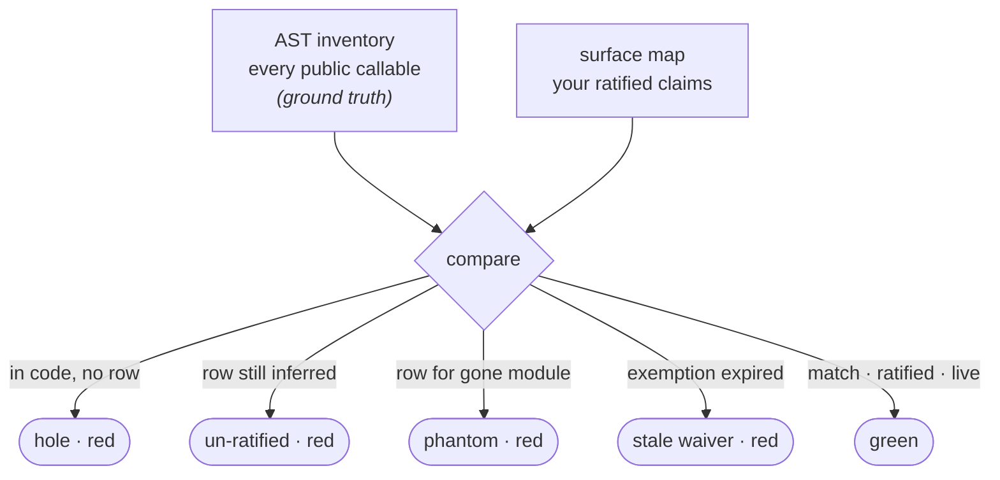

# Surface roles

The surface gates are the heart of the proving checks. They all rest on one
thing: a **surface map** — the list of every public function in your code, each
one paired with the job you've assigned it. Build that map with
`celebrimbor init --surfaces`, and four checks run on top of it. Until you build
it, all four simply skip, so they never turn your first day red.

See [Roles & obligations](../concepts/roles.md) for the full set of jobs a
function can have (its **role**) and how you assign one — celebrimbor guesses,
and you confirm by hand. This page is about the four gates that read the map.

## Completeness

`celebrimbor.surface.completeness` is the gate everything else stands on. Each
proving check keys off a function's role, and a role means nothing unless the map
covers *every* function — no gaps. This gate is what guarantees that.

It compares two lists built independently. One is the **inventory** — the ground
truth, every public function read straight from your source. The other is the
**surface map** — the jobs you've confirmed. If the two drift apart in any
direction, the gate goes red:

- a public function that has no row in the map — a gap;
- a row celebrimbor guessed but you haven't confirmed yet — red until a human
  confirms it;
- a row for a module that no longer exists — the map describing code that's gone;
- an exemption whose review date has passed.



In short, completeness means the code and the map describe exactly the same set
of functions, and any of those four kinds of drift breaks that. It's the reason
the map can never quietly fall behind the code.

!!! important "AST-only, never imported"
    Celebrimbor builds the inventory by *parsing* your source (`ast.parse`), never
    by running it (`import`). This matters: a module that crashes when imported
    would hand back no functions at all, so an inventory built by importing would
    cheerfully report "everything's accounted for" at the exact moment the code
    is most broken. A module that won't even parse stays in the inventory with its
    error attached and is reported as a **refusal** — it can never silently drop
    out of the count.

## Naming

`celebrimbor.surface.naming` catches a confirmed row that's quietly gone stale.
If a function's *name* points to a bigger, more demanding job than the one it's
been assigned, the gate reports it — but only in that dangerous direction.

Say you add `fetch_remote()` to a module you confirmed as `pure`. The name reads
like an `adapter` — a function that talks to the outside world, which owes far
more proof than a pure one. Without this gate, the new function would silently
inherit a judgment nobody actually made about it. A name that suggests *less*
than its assigned role is harmless — the role still wins — so it isn't flagged.

## Evidence

`celebrimbor.surface.evidence` is what turns a role from a mere *label* into a
*claim the code has to back up*. For each confirmed function it reads the code and
checks the things the role must be true for, and goes red on a contradiction:

- a `verifier` or `parser` with no path that can actually fail — it can never turn
  red, so it can never catch anything;
- an `adapter` that touches nothing outside and calls nothing handed in — it
  adapts nothing (this closes the trick of labelling something an `adapter` just
  to unlock its wide-open budget);
- a `pure` function that changes one of its arguments or reaches for the outside
  world;
- a `producer` that returns nothing and leaves no visible effect — it produces
  nothing;
- an `orchestrator` with fewer than two things to coordinate — it coordinates
  nothing.

These spot *contradictions*; they don't prove the function correct. Passing means
"not provably wrong" — the same honest, modest bar the verifier check has always
held to. The positive proof that it does the right thing still lives in your
tests.

## Pin

`celebrimbor.surface.pin` locks your confirmation to the exact code you confirmed
it against. When you confirm a row, celebrimbor takes a fingerprint of the
function's role-relevant *shape* — what it reaches for, whether it can fail,
whether it changes its inputs, how many collaborators it has, roughly how complex
it is (but not names or literal values). If that shape later changes, the row
drops back to unconfirmed and goes red, re-opening the question.

This is deliberately separate from the evidence gate. Evidence catches a role
that was *always* wrong; the pin catches a role that *used to be right and stopped
being*. Rewrite a three-line parser into something that opens a network socket —
same name, same role, same declared reaches — and the pin is the only gate that
notices.

## Overrides and exemptions

If a single function does a different job than the rest of its module, give it a
one-line override:

```yaml
modules:
  myapp.render:
    role: producer
    status: ratified
    overrides:
      debug_dump: pure     # ratified by typing it
```

A function that genuinely owes no proof can be exempted by name — but always out
in the open, with a reason and a date to revisit it, never silently:

```yaml
exemptions:
  myapp.util:banner:
    reason: pure string constant, no behaviour to prove
    review_by: 2026-12-01
```
