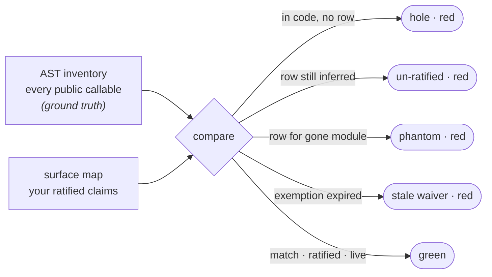

# Surface roles

The surface gates are the heart of the obligation engine. They rest on one
guarantee — that celebrimbor knows *every* public callable in your application —
and build four checks on top of it. All are obligation: they skip until you author
the surface map (`celebrimbor init --surfaces`), then run against it.

See [Roles & obligations](../concepts/roles.md) for the taxonomy and the
inference/ratification model. This page is the four gates.

## Completeness

`celebrimbor.surface.completeness` is the gate everything else rests on. Every
obligation gate keys on role, so a role means nothing unless the map is *complete*.

It compares two independently-derived sets: the **AST inventory** (ground truth,
walked from your source bytes) and the **surface map** (your ratified claims). It
reddens on drift in either direction:

- a public callable with no map row — a completeness hole;
- an inferred (un-ratified) row — red until a human confirms;
- a map row for a module that no longer exists — the ledger describing code that
  is gone;
- an exemption past its review date.



Completeness is set-equality between what the code *is* and what the map
*claims*, and any of the four drifts fails it. This is why the count can never
quietly fall behind the code.

!!! important "AST-only, never imported"
    The inventory is built with `ast.parse`, never `import`. A module that raises
    on import produces *no* callables, and a completeness count built by
    importing would report "everything is accounted for" precisely when the code
    is most broken. A module that will not even parse is kept in the inventory
    with its error and reported as a **refusal** — it can never silently drop
    out of the count.

## Naming

`celebrimbor.surface.naming` is the drift detector that keeps a ratified row from
going stale. If a callable's *name* decodes to a role stronger than the one it is
assigned, that is reported — in the dangerous direction only.

Add `fetch_remote()` to a module ratified as `pure` and its name decodes to
`adapter` (a much higher obligation). Without this gate the new callable would
silently inherit a judgment nobody made about it. A name suggesting *less* proof
than the role is harmless — the role still wins — so it is not flagged.

## Evidence

`celebrimbor.surface.evidence` is what turns a role from a *label* into a
*claim*. For each ratified callable it checks necessary conditions the role
implies, from the AST, and reddens on a contradiction:

- `verifier` / `parser` with no reachable failing path — can never turn red;
- `adapter` that touches no capability and calls nothing handed in — adapts
  nothing (this closes the "declare `adapter` for the open budget" escape);
- `pure` that mutates a parameter or reaches for a capability;
- `producer` with no observable effect and no return — produces nothing;
- `orchestrator` with fewer than two collaborators — coordinates nothing.

These are **necessary contradiction detectors**, not proofs. Passing means "not
provably wrong", the same honesty level the verifier check has always had. The
positive proof lives in your tests.

## Pin

`celebrimbor.surface.pin` binds ratification to the code it ratified. When you
ratify a row, celebrimbor stamps a hash of the callable's role-relevant *shape*
(capabilities reached, can-it-fail, mutates-inputs, collaborator count,
complexity band — not names or literals). If that shape later drifts, the row
reverts to un-ratified and goes red.

This is deliberately separate from the evidence gate. Evidence catches a role
that was *always* wrong; the pin catches a role that *stopped being right*.
Rewrite a three-line parser into something that opens a socket — same name, same
role, same declared capabilities — and only the pin notices.

## Overrides and exemptions

A single callable that differs from its module's default gets a one-line
override:

```yaml
modules:
  myapp.render:
    role: producer
    status: ratified
    overrides:
      debug_dump: pure     # ratified by typing it
```

A callable that genuinely owes no proof is exempted by name, with a reason and a
review date — never silently:

```yaml
exemptions:
  myapp.util:banner:
    reason: pure string constant, no behaviour to prove
    review_by: 2026-12-01
```
