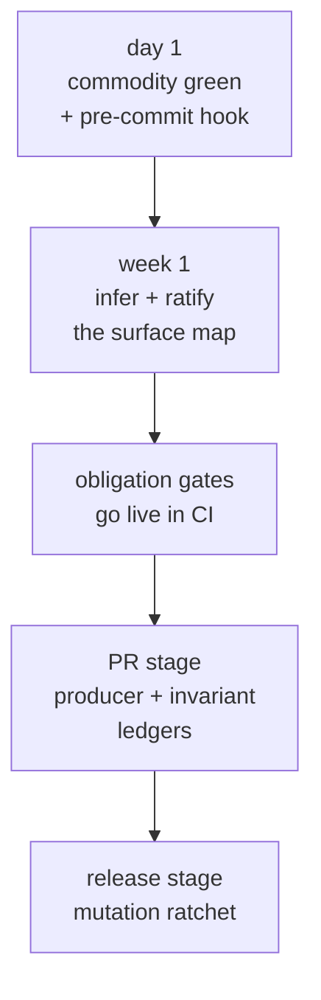

# Adopting an existing app

You don't have to adopt celebrimbor all at once. The everyday checks — lint,
types, formatting, complexity — go green in minutes. The deeper proving checks,
the ones that make your code prove it's what it claims, you grow into over time.
Nothing forces a big-bang migration.



This guide walks a real, established codebase through the whole path.

## 1. The everyday checks first

```bash
pip install "celebrimbor[commodity]"
celebrimbor init
celebrimbor gate --fast
```

On an established repo, expect the structure checks to find real issues — long
functions, modules that mix unrelated concerns. You have two honest responses:
fix what you can now, and **grandfather the rest**. Don't just raise the limits
across the board to quiet it down — that throws away the warning for the code you
write tomorrow. Instead, record today's debt once, in CI, as a starting line the
gate holds you to:

```bash
celebrimbor gate --update-baselines --reason "adopting on a legacy tree"
```

This freezes today's breaches into `.celebrimbor/baselines/structure.yaml`
(which you commit). This is a *ratchet* — a one-way gate: new or worse breaches
still turn the gate red, but the grandfathered ones can only shrink from here,
never grow back. See [Ratchets](../gate/ratchets.md#structure-grandfather-the-debt-hold-the-line).

Commit the config `init` wrote. Wire `celebrimbor gate` into CI (see
[Getting started](../getting-started.md#use-it-from-ci)).

## 2. Generate and ratify the surface map

```bash
celebrimbor init --surfaces
```

This builds the **surface map** — the list of every public function in your code
and the job (its *role*) you've assigned each one. celebrimbor guesses the roles
it's confident about and holds back on the rest rather than guess wrong. Open
`.celebrimbor/surfaces.yaml` and review it. Every guessed row is marked
`inferred` and stays **red** until you confirm it by hand — until you *ratify*
it. For each module:

- If the guessed role is right, leave it — you'll ratify everything in bulk next.
- If a single function differs, add a one-line override.
- If the guess was left blank (no row), add the module by hand with `status:
  ratified`. The completeness check names the exact modules that need this.

Then ratify. This also *pins* each row to the code as it stands, so a later
rewrite re-opens the question:

```bash
celebrimbor ratify --all       # after you've reviewed; or name modules individually
```

Now `gate --fast` also checks that every function is accounted for, that roles
are named consistently, that each function's code matches its assigned job (the
*evidence* check), and that no function reaches for parts of the outside world it
isn't allowed to touch (the *capabilities* check). Those last two will surface
real findings: a `verifier` that can't fail, an `adapter` label on a pure helper,
a `pure` function that secretly reads the clock. Each one is a one-line override,
a change of role, or a genuine fix.

## 3. Ledgers (PR stage)

If you have `producer` functions — ones that build an artifact — record them in
the producer ledger. Each names the `verifier` that inspects what it built (which
has to resolve to a real function the map classifies as a `verifier`) and a
*negative fixture*: a kept example of the bad case the verifier must reject, proof
it can actually catch a failure. Anything not ready yet goes in `pending:` with a
review date. Full schema in [Ledgers](../gate/ledgers.md).

```yaml
# .celebrimbor/producers.yaml
producers:
  "myapp.report:write_manifest":
    verifier: myapp.checks:check_manifest_valid
    negative_fixture: tests/negative/test_manifest.py::test_corrupt_manifest_rejected
pending:
  "myapp.export:dump_bundle":
    reason: verifier lands with the export rework in #212
    review_by: 2026-10-01
```

If your system makes promises worth naming — rules that must always hold — record
them in the invariant ledger. Start with the critical ones. Each needs a
`negative_proof`: a kept example of the promise being broken, so you know the
check can catch it. Once invariants exist, the
[impact gate](../gate/ledgers.md#the-impact-gate) — the check that flags when you
change important code no recorded promise is watching over — starts keeping an
eye on changes to the modules that carry your rules.

```yaml
# .celebrimbor/invariants.yaml
invariants:
  order-has-customer:
    statement: every order references an existing customer
    enforced_by: myapp.orders:validate_order
    critical: true
    negative_proof: tests/negative/test_orders.py::test_orphan_order_rejected
```

```bash
celebrimbor gate          # PR stage: + coverage ratchet, invariants, impact
```

The coverage ratchet sets its own starting line on its first run *in CI*, and
from there the floor can only rise.

## 4. Mutation (release stage)

```bash
celebrimbor gate --full   # + mutation
```

## Migrating from an existing inline harness

If your project already has its own hand-built quality tooling — a surface map,
invariants, ratchets, domain-specific checks, a fixture auditor — the goal is to
**run all of it through `celebrimbor gate`** and delete the parallel code. Every
connection point below exists so you keep your data and your tools while you stop
maintaining a second setup. Each one *fails closed*: when something can't run,
the gate stops and turns red rather than quietly waving it through.

**Keep your data where it lives.** `[tool.celebrimbor.paths]` points celebrimbor
at your existing files — no need to reorganise the repo:

```toml
[tool.celebrimbor.paths]
surfaces = "quality/surfaces.yaml"
invariants = "quality/invariants.yaml"
producers = "quality/producers.yaml"
coverage_baseline = "quality/coverage-baseline.yaml"
mutation_baseline = "quality/mutation-baseline.yaml"
structure_baseline = "quality/structure-baseline.yaml"
```

Extra fields in your ledgers are fine — the loader ignores keys it doesn't know
about (owner, risk, ticket links), so your own annotations survive untouched.

**Run your own checks through the CLI.** Any check you register with
[`@celebrimbor.check`](custom-checks.md) runs through `celebrimbor gate` once you
name its module — no separate entry point to maintain. A module that won't import
is a hard error, so a check can never silently disappear:

```toml
[tool.celebrimbor]
check_modules = ["myapp.quality_checks"]
```

An existing zero-argument `check_foo()` that raises when it fails becomes a
celebrimbor check with a thin wrapper (see [Writing custom checks](custom-checks.md#adapting-a-raise-on-failure-check));
from then on it runs under the same completeness guarantee as the built-in checks.

**Prove your own known-bad fixtures with your own linter.** Your known-bad
fixtures are kept examples of code that should be rejected. If yours are caught by
a domain-specific linter (not ruff or mypy), tell celebrimbor how to run it —
either as a subprocess, or in-process for a checker with no clean per-file entry
point — and match its output by exact code, or by substring for linters that emit
a phrase. This lets you retire a hand-built fixture-checking script:

```toml
[tool.celebrimbor.known_bad_checkers.style_audit]
callable = "myapp.editorial:diagnostics_for"   # or: command = "... {file}"
match = "substring"
```

See [Fixtures & markers](../gate/fixtures.md#known-bad-provenance).

**Bring over your invariants in full.** A single invariant can keep **several**
`negative_proof`s (each one is checked) and can declare `limitations:` — the cases
it knowingly doesn't cover. Turn on
[`markers_cite_limitations`](../gate/fixtures.md#citing-limitations) and any test
you silence has to cite one of those limitations by name. That way a known gap
can't be mistaken for someone just shrugging past a failure — and you retire the
limitation half of a hand-built test-marker system.

**Feed your own mutation set.** *Mutation testing* deliberately breaks your code
in small ways and checks that a test notices; a mutant that survives is a bug your
tests would miss. If you generate mutants in your own repeatable way rather than
with mutmut, hand celebrimbor the surviving ones and let its identity ratchet gate
them (`mutation_survivors = "myapp.mutation:survivors"` — see
[Ratchets](../gate/ratchets.md#mutation-survivor-identity-not-count)) — retiring a
home-grown mutation script.

The payoff: one `celebrimbor gate` command runs your domain checks, your
fixture-checking, and your invariants right alongside the built-in checks — all
under the same rule that stops and refuses rather than passing on doubt, and lets
no check slip through unrun — and the second setup is deleted.
