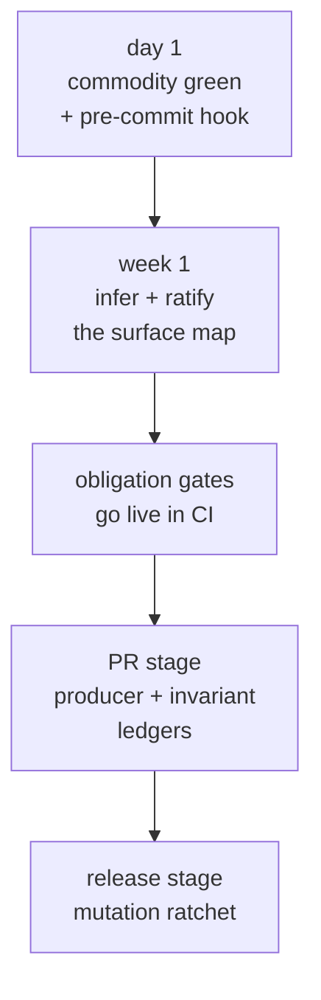

# Adopting an existing app

Celebrimbor is designed to be adopted incrementally. The commodity ladder goes
green in minutes; the obligation engine you grow into. Nothing forces a big-bang
migration.



This guide walks a real, established codebase through the whole path.

## 1. commodity first

```bash
pip install "celebrimbor[commodity]"
celebrimbor init
celebrimbor gate --fast
```

On an established repo, expect the structure gates to find real issues — long
functions, mixed-domain modules. You have two honest responses: fix what you can
now, and **grandfather the rest**. Do not raise the limits globally to make it
quiet — that discards the signal for the code you write tomorrow. Instead,
baseline the existing debt once, in CI:

```bash
celebrimbor gate --update-baselines --reason "adopting on a legacy tree"
```

This freezes today's breaches into `.celebrimbor/baselines/structure.yaml`
(committed). New or worsened breaches still redden; the grandfathered ones can
only shrink. See [Ratchets](../gate/ratchets.md#structure-grandfather-the-debt-hold-the-line).

Commit the config `init` wrote. Wire `celebrimbor gate` into CI (see
[Getting started](../getting-started.md#use-it-from-ci)).

## 2. Generate and ratify the surface map

```bash
celebrimbor init --surfaces
```

Inference pre-fills the rows it is confident about and abstains on the rest.
Open `.celebrimbor/surfaces.yaml` and review it. Every row is `inferred` and
**red** until you ratify it. For each module:

- If the inferred role is right, leave it — you will ratify in bulk next.
- If a single callable differs, add a one-line override.
- If inference abstained (no row), add the module by hand with `status:
  ratified`. The completeness gate names the exact modules that need this.

Then ratify — this also pins each row to the current code:

```bash
celebrimbor ratify --all       # after you've reviewed; or name modules individually
```

Now `gate --fast` runs completeness, naming, evidence, and capabilities. The
evidence and capability gates will surface real findings: a `verifier` that can't
fail, an `adapter` label on a pure helper, a `pure` function that reaches for the
clock. Each is a one-line override, a reclassification, or a genuine fix.

## 3. Ledgers (PR stage)

If you have producers, write the producer ledger — each names its verifier
(which must resolve to a real callable the map classifies `verifier`) and a
negative fixture. Anything not ready goes in `pending:` with a review date. Full
schema in [Ledgers](../gate/ledgers.md).

```yaml
# .celebrimbor/producers.yaml
producers:
  "myapp.report:write_manifest":
    verifier: myapp.checks:check_manifest_valid
    negative_fixture: tests/negative/test_manifest.py::test_corrupt_manifest_rejected
pending:
  "myapp.export:dump_bundle":
    reason: verifier lands with the export rework in #212
    review_by: 2026-10-01
```

If your system makes promises worth naming, write the invariant ledger. Start
with the critical ones; each needs a `negative_proof`. Once invariants exist, the
[impact gate](../gate/ledgers.md#the-impact-gate) begins governing changes to
your policy-role modules.

```yaml
# .celebrimbor/invariants.yaml
invariants:
  order-has-customer:
    statement: every order references an existing customer
    enforced_by: myapp.orders:validate_order
    critical: true
    negative_proof: tests/negative/test_orders.py::test_orphan_order_rejected
```

```bash
celebrimbor gate          # PR stage: + coverage ratchet, invariants, impact
```

The coverage ratchet auto-baselines on its first run *in CI* and only rises
after.

## 4. Mutation (release stage)

```bash
celebrimbor gate --full   # + mutation
```

## Migrating from an existing inline harness

If your project already has a hand-rolled quality harness — its own surface map,
invariants, ratchets, domain checks, fixture auditor — the goal is to **run all
of it through `celebrimbor gate`** and delete the parallel code. Every seam below
exists so you keep your data and your tooling, and stop maintaining a second
harness. Each is fail-closed: a thing that will not run is red, never a quiet
pass.

**Keep your data where it lives.** `[tool.celebrimbor.paths]` points celebrimbor
at existing files — no repo reorganisation:

```toml
[tool.celebrimbor.paths]
surfaces = "quality/surfaces.yaml"
invariants = "quality/invariants.yaml"
producers = "quality/producers.yaml"
coverage_baseline = "quality/coverage-baseline.yaml"
mutation_baseline = "quality/mutation-baseline.yaml"
structure_baseline = "quality/structure-baseline.yaml"
```

Extra fields in your ledgers are tolerated — the loader ignores keys it does not
know (owner, risk, ticket links), so your annotations survive.

**Run your own checks through the CLI.** Any check you register with
[`@celebrimbor.check`](custom-checks.md) runs through `celebrimbor gate` once you
name its module — no bespoke entry point. A module that will not import is a hard
error, so a check can never silently vanish:

```toml
[tool.celebrimbor]
check_modules = ["myapp.quality_checks"]
```

An existing zero-argument `check_foo()` that raises on failure becomes a
celebrimbor check with a thin wrapper (see [Writing custom checks](custom-checks.md#adapting-a-raise-on-failure-check));
it then runs under the same completeness guarantee as the builtins.

**Prove your own known-bad fixtures with your own linter.** If your fixtures are
caught by a domain linter (not ruff/mypy), declare how to run it — as a
subprocess or, for a checker with no clean per-file entry, in-process — and match
by exact code or by substring for phrase-emitting linters. This retires a
hand-rolled fixture-provenance auditor:

```toml
[tool.celebrimbor.known_bad_checkers.style_audit]
callable = "myapp.editorial:diagnostics_for"   # or: command = "... {file}"
match = "substring"
```

See [Fixtures & markers](../gate/fixtures.md#known-bad-provenance).

**Bring over your invariants in full.** An invariant may keep **several**
`negative_proof`s (each is checked) and declare `limitations:` — the cases it
knowingly does not cover. Turn on
[`markers_cite_limitations`](../gate/fixtures.md#citing-limitations) and a
suppressed test must cite one of those limitations, so a known gap can't be
confused with a shrug — retiring the limitation half of a hand-rolled marker
grammar.

The payoff: one `celebrimbor gate` command runs your domain checks, your fixture
provenance, and your invariants alongside the builtins, all under the same
fail-closed, no-check-escapes guarantee — and the second harness is deleted.
