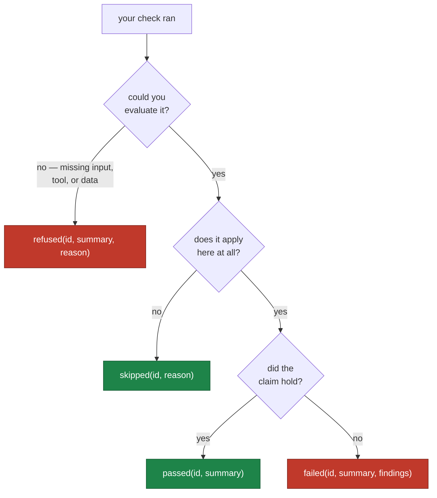

# Writing custom checks

`@celebrimbor.check` is the one documented seam for app-specific checks. There is
deliberately no exposed registry object to poke at — a raw registry invites app
code to bypass registration, and the completeness guarantee is only as good as
the claim that `@check` is the one door.

## The decorator

```python
import celebrimbor

@celebrimbor.check(
    id="myapp.manifest",
    title="every built artifact is listed in the manifest",
    stage="fast",
    falsified_by="tests/known-bad/manifest_missing_entry.json",
)
def check_manifest(ctx: celebrimbor.Context) -> celebrimbor.CheckResult:
    manifest = ctx.root / "dist" / "manifest.json"
    if not manifest.exists():
        return celebrimbor.CheckResult.refused(
            "myapp.manifest", "no manifest to check",
            reason="dist/manifest.json does not exist",
        )
    missing = find_unlisted_artifacts(ctx.root, manifest)
    if missing:
        return celebrimbor.CheckResult.failed(
            "myapp.manifest", f"{len(missing)} artifact(s) not in the manifest",
            [celebrimbor.Finding(message=str(p), path=p) for p in missing],
        )
    return celebrimbor.CheckResult.passed("myapp.manifest", "manifest is complete")
```

Your check runs in the same ordered registry as the builtins, under the same
guarantee that no check escapes the runner, and its result flows through the same
fail-closed vocabulary.

### Every parameter

| Parameter | Meaning |
|---|---|
| `id` | unique, dotted, namespaced to your app (`myapp.*`) — ids address results |
| `title` | one line, shown in gate output |
| `falsified_by` | **required** — the fixture/test that turns it red, or an `Unproven` (see below) |
| `stage` | `"fast"` (pre-commit) · `"default"` (PR) · `"full"` (release). Default `"fast"` |
| `family` | `Family.COMMODITY` (default — always runs) or `Family.OBLIGATION` (opt-in; use this if your check reads an authored ledger and should *skip* when it is absent) |
| `tags` | optional labels for your own grouping |

A check that reads a ledger you author should declare itself `obligation` so it
skips (not fails) on a project that has not opted in:

```python
from celebrimbor import Family

@celebrimbor.check(
    id="myapp.migrations",
    title="every migration is listed in the manifest ledger",
    stage="default",
    family=Family.OBLIGATION,
    falsified_by="tests/negative/test_migrations.py::test_orphan_migration",
)
def check_migrations(ctx): ...
```

## `falsified_by` is required

There is no default. The framework will not let you register a gate without
saying how you know the gate works. Pass the path or pytest node id of a negative
fixture that turns the check red. Celebrimbor's own suite has a meta-test that
resolves every `falsified_by` to a real test — so a promise you write here is one
you have to keep.

If a falsifier does not exist *yet*, admit it explicitly with a review date,
rather than silently:

```python
from celebrimbor import Unproven

@celebrimbor.check(
    id="myapp.wip",
    title="a check whose fixture is coming",
    falsified_by=Unproven("negative fixture lands in #142", review_by="2026-09-01"),
)
def check_wip(ctx): ...
```

An `Unproven` is visible in every gate run and *expires* — past the review date
it reddens. Debt with a deadline, never debt in silence.

## The context

A check receives a `Context` with everything it is allowed to know:

- `ctx.root` — the project root (a `Path`).
- `ctx.config` — resolved configuration, including source/test paths and the
  ledger locations.
- `ctx.stage` — the stage being run.
- `ctx.changed_files()` — repo-relative paths changed against the diff base, or
  `None` if the diff cannot be computed (treat `None` as a reason to refuse).
- `ctx.is_git_repo()` — whether the root is a git working tree.
- `ctx.memo(key, produce)` — compute an expensive artifact once per run and share
  it across checks (this is how the builtin gates parse the AST once, not
  per-check, and is most of what keeps the fast stage under budget).

A check must **not** branch on other checks' results — a check whose verdict
depends on another's is a check whose falsifier no longer isolates it. Only the
terminal completeness check may read the in-progress report.

### Findings carry location

`Finding` is how a `fail` points at the problem. Give it everything you have — the
gate output uses all of it:

```python
celebrimbor.Finding(
    message="cyclomatic complexity is 14 (limit 10)",
    path=Path("src/app/core.py"),
    line=42,
    code="complexity",          # short slug, groupable
    hint="extract the branches into named helpers",
)
```

## Adapting a "raise on failure" check

If you are migrating an existing harness whose checks are zero-argument functions
that raise, wrap them once:

```python
def adapt(check_id, title, fn):
    @celebrimbor.check(id=check_id, title=title,
                       falsified_by="tests/negative/test_domain.py")
    def _wrapped(ctx):
        try:
            fn()
        except AssertionError as exc:
            return celebrimbor.CheckResult.failed(
                check_id, f"{title}: failed",
                celebrimbor.Finding(message=str(exc)),
            )
        return celebrimbor.CheckResult.passed(check_id, f"{title}: held")
    return _wrapped
```

Everything the existing check does keeps working; only the wrapper is new.

## Returning a good result

Use the constructors — they encode which fields each verdict requires. Which one
you reach for is a short decision:



| Constructor | Use when |
|---|---|
| `CheckResult.passed(id, summary)` | the claim was checked and held |
| `CheckResult.failed(id, summary, findings, remedy=...)` | proved a violation — must have findings |
| `CheckResult.refused(id, summary, reason, remedy=...)` | could not check — the fail-closed path |
| `CheckResult.skipped(id, reason)` | not applicable here — must have a reason |

Do not reach for `passed` when you could not actually check something. Reach for
`refused`. That is the whole discipline.
