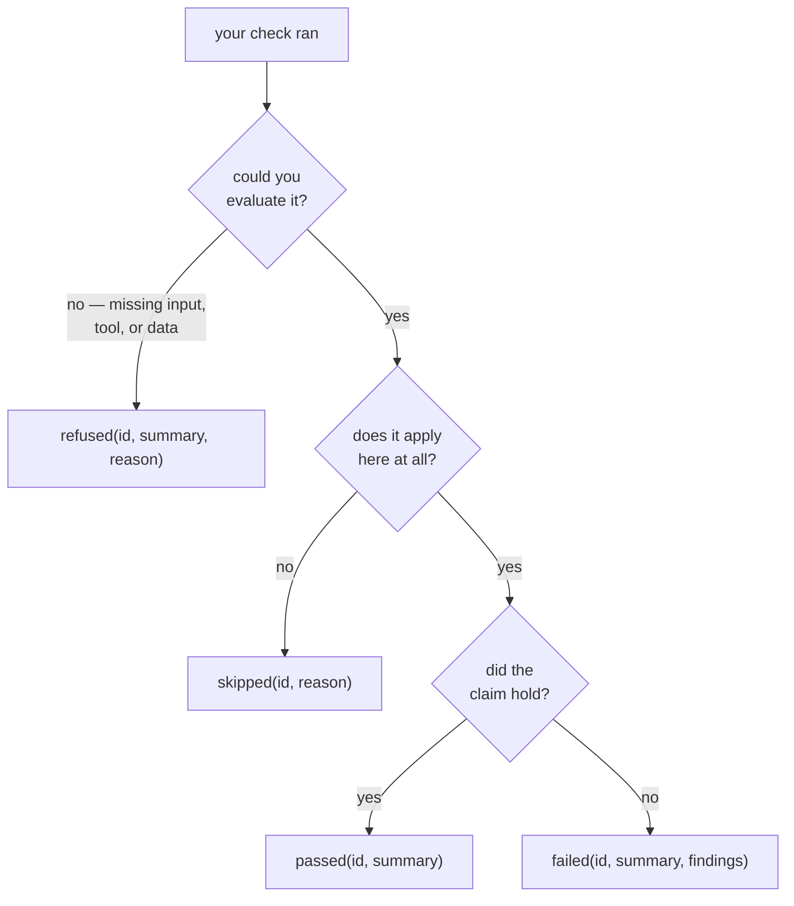

# Writing custom checks

`@celebrimbor.check` is the one supported way to add your own app-specific
checks. There's deliberately no registry object you can reach in and edit
directly — if there were, app code could add a check behind the runner's back,
and celebrimbor's promise that *no check escapes* is only as good as the rule that
`@check` is the single door in.

## The decorator

```python
import celebrimbor

@celebrimbor.check(
    id="myapp.manifest",
    title="every built artifact is listed in the manifest",
    stage="fast",
    falsified_by="tests/known-bad/manifest_missing_entry.json",
)
def check_manifest(ctx: celebrimbor.Context) -> celebrimbor.CheckResult:
    manifest = ctx.root / "dist" / "manifest.json"
    if not manifest.exists():
        return celebrimbor.CheckResult.refused(
            "myapp.manifest", "no manifest to check",
            reason="dist/manifest.json does not exist",
        )
    missing = find_unlisted_artifacts(ctx.root, manifest)
    if missing:
        return celebrimbor.CheckResult.failed(
            "myapp.manifest", f"{len(missing)} artifact(s) not in the manifest",
            [celebrimbor.Finding(message=str(p), path=p) for p in missing],
        )
    return celebrimbor.CheckResult.passed("myapp.manifest", "manifest is complete")
```

Your check runs in the same ordered list as the built-in checks, under the same
promise that no check escapes the runner. Its result speaks the same
*fail-closed* language too: when a check can't confirm something is right, it
stops and refuses rather than passing it through.

## Make the CLI run it

The decorator registers your check the moment its module is imported — so
`celebrimbor gate` only sees the check if something imports that module. Tell the
CLI which modules to import:

```toml
[tool.celebrimbor]
check_modules = ["myapp.quality_checks"]
```

The CLI imports each listed module (after the built-in checks, before the run
starts), so your domain checks run through `celebrimbor gate` itself — the same
one-line pre-commit hook and CI step everyone else uses. The completeness check
then covers your checks too: it always runs *last*, no matter when a check was
registered, so anything loaded this way runs before it and gets counted.

A module that won't import is a **hard error that fails the gate**, not a quietly
smaller run — a declared check that disappears is the exact failure celebrimbor
exists to prevent. Without `check_modules`, the CLI runs only the built-in checks
and yours are simply absent. So this is the setting that lets you *lean on* the
CLI instead of wrapping it in your own.

### Every parameter

| Parameter | Meaning |
|---|---|
| `id` | unique, dotted, namespaced to your app (`myapp.*`) — ids address results |
| `title` | one line, shown in gate output |
| `falsified_by` | **required** — the fixture/test that turns it red, or an `Unproven` (see below) |
| `stage` | `"fast"` (pre-commit) · `"default"` (PR) · `"full"` (release). Default `"fast"` |
| `family` | `Family.COMMODITY` (default — always runs) or `Family.OBLIGATION` (opt-in; use this if your check reads an authored ledger and should *skip* when it is absent) |
| `tags` | optional labels for your own grouping |

The `family` says what kind of check this is: an everyday one that always runs
(`commodity`), or one of the proving checks that reads a ledger you write and
should only run once a project has opted in (`obligation`). A check that reads a
ledger you author should declare itself `obligation`, so on a project that hasn't
opted in it *skips* rather than fails:

```python
from celebrimbor import Family

@celebrimbor.check(
    id="myapp.migrations",
    title="every migration is listed in the manifest ledger",
    stage="default",
    family=Family.OBLIGATION,
    falsified_by="tests/negative/test_migrations.py::test_orphan_migration",
)
def check_migrations(ctx): ...
```

## `falsified_by` is required

There's no default. celebrimbor won't let you register a check without saying how
you know the check actually works — how you know it can be caught being wrong.
That's a *falsifier*: a way the check could be shown to fail, in practice a test
that genuinely turns it red when it should. Pass the path or pytest node id of a
known-bad fixture that does exactly that. celebrimbor's own test suite has a
meta-test that resolves every `falsified_by` to a real test — so a promise you
write here is one you have to keep.

If that falsifier doesn't exist *yet*, say so out loud, with a review date,
instead of leaving it silent:

```python
from celebrimbor import Unproven

@celebrimbor.check(
    id="myapp.wip",
    title="a check whose fixture is coming",
    falsified_by=Unproven("negative fixture lands in #142", review_by="2026-09-01"),
)
def check_wip(ctx): ...
```

An `Unproven` shows up in every gate run and *expires* — past the review date it
turns the gate red. Debt with a deadline, never debt in silence.

## The context

A check receives a `Context` with everything it is allowed to know:

- `ctx.root` — the project root (a `Path`).
- `ctx.config` — resolved configuration, including source/test paths and the
  ledger locations.
- `ctx.stage` — the stage being run.
- `ctx.changed_files()` — repo-relative paths changed against the diff base, or
  `None` if the diff cannot be computed (treat `None` as a reason to refuse).
- `ctx.is_git_repo()` — whether the root is a git working tree.
- `ctx.memo(key, produce)` — compute an expensive artifact once per run and share
  it across checks (this is how the builtin gates parse the AST once, not
  per-check, and is most of what keeps the fast stage under budget).

A check must **not** make its decision based on other checks' results. Once one
check's verdict depends on another's, its falsifier no longer tests it on its own
— you can't be sure what would actually turn it red. Only the final completeness
check is allowed to read the run-in-progress.

### Findings carry location

`Finding` is how a `fail` points at the problem. Give it everything you have — the
gate output uses all of it:

```python
celebrimbor.Finding(
    message="cyclomatic complexity is 14 (limit 10)",
    path=Path("src/app/core.py"),
    line=42,
    code="complexity",          # short slug, groupable
    hint="extract the branches into named helpers",
)
```

## Adapting a "raise on failure" check

If you're moving over from existing tooling whose checks are zero-argument
functions that raise an exception when they fail, wrap each one once:

```python
def adapt(check_id, title, fn):
    @celebrimbor.check(id=check_id, title=title,
                       falsified_by="tests/negative/test_domain.py")
    def _wrapped(ctx):
        try:
            fn()
        except AssertionError as exc:
            return celebrimbor.CheckResult.failed(
                check_id, f"{title}: failed",
                celebrimbor.Finding(message=str(exc)),
            )
        return celebrimbor.CheckResult.passed(check_id, f"{title}: held")
    return _wrapped
```

Everything the existing check does keeps working; only the wrapper is new.

## Returning a good result

Use the constructors — each one requires exactly the fields its verdict needs.
Picking the right one is a short decision:



| Constructor | Use when |
|---|---|
| `CheckResult.passed(id, summary)` | the claim was checked and held |
| `CheckResult.failed(id, summary, findings, remedy=...)` | proved a violation — must have findings |
| `CheckResult.refused(id, summary, reason, remedy=...)` | could not check — the fail-closed path |
| `CheckResult.skipped(id, reason)` | not applicable here — must have a reason |

Never reach for `passed` when you couldn't actually check something. Reach for
`refused` instead. That one habit — refuse when you can't prove, don't guess green
— is the whole discipline.
