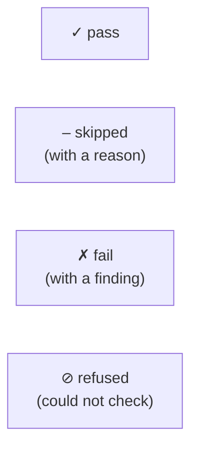

# Troubleshooting

Every red or skipped line celebrimbor prints is trying to tell you something
specific. This page decodes the ones adopters hit most, and — because the tool
fails closed — explains why several of them are red *on purpose*.

## The four verdicts, and which are red

The one people trip on: **`⊘ refused` is red.** "I could not check this" is not
"this is fine" — collapsing them is how a missing tool or an unparseable file
becomes a silent pass. See [Fail closed](../concepts/fail-closed.md).

## Common messages

### `⊘ … the check itself raised`
A gate threw an exception. The traceback is in the reason (`-v` shows it). This
is a bug in the *gate*, not your code — if it's a custom check, it should return
`CheckResult.refused(...)` with a reason instead of raising.

### `– skipped: no surface map — run celebrimbor init --surfaces`
An obligation gate has nothing to read yet. This is **not red** — the obligation
family is opt-in. Run `celebrimbor init --surfaces`, then `celebrimbor ratify`.
Until then, only the commodity ladder runs.

### `✗ … is ratified but its shape has drifted`
A ratified callable changed character (it now reaches a capability, can fail
where it couldn't, mutates its inputs…), so its [pin](../concepts/roles.md#ratification-is-pinned-to-the-code)
no longer matches. Confirm the role still fits and re-run `celebrimbor ratify
<module>`. This is the gate catching an edit that outgrew its sign-off.

### `✗ … 3 new or worsened structural breach(es)`
You added complexity beyond the budget *or* beyond the grandfathered baseline.
Fix the code, or — if you are adopting on a legacy tree — grandfather the
existing debt once: `celebrimbor gate --update-baselines --reason "adopting"`
in CI. See [Ratchets](../gate/ratchets.md#structure-grandfather-the-debt-hold-the-line).

### `⊘ coverage could not be measured` / `– no baseline yet`
The coverage ratchet reads a `.coverage` file — run your suite under `coverage
run -m pytest` first. On a dev box with no committed baseline it *skips*
(baselines are taken only in CI, so a local run never reads a floor higher than
CI will). See [Ratchets](../gate/ratchets.md).

### `⊘ the set of changed files could not be determined`
The [impact gate](../gate/ledgers.md#the-impact-gate) needs a diff base. In a PR
it resolves the merge base automatically; locally, pass `--diff-base HEAD` (or
`--diff-base main`). It refuses rather than assume nothing changed.

### `✗ unproven … past its review date` / `pending … passed its review date`
A dated admission of missing proof ([`Unproven`](../gate/meta.md) or a `pending`
producer) has expired. Write the missing falsifier/verifier, or re-justify with
a new date. The allowlist is designed to shrink.

### `⊘ … config key 'foo' is not recognized`
celebrimbor refuses an unknown `[tool.celebrimbor]` key rather than ignoring it —
a typo'd key would silently leave a setting unenforced. Fix the spelling; the
[configuration reference](../reference/configuration.md) lists every valid key.

## "It's red and I think it's wrong"

celebrimbor's own gate is green at every stage, so a false positive is a bug
worth reporting. But first: run with `-v` for the full finding and hint, and
check whether the honest fix is the one the gate is pointing at — the most common
"false positive" is a `pure` function that really did quietly gain a side effect,
or a `verifier` that really can't fail. If it's genuinely wrong,
[open an issue](https://github.com/clintecker/celebrimbor/issues).
