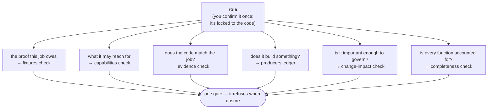

---
hide:
  - navigation
---

# celebrimbor

**A quality tool that comes with the good defaults already chosen — and that
holds every part of your code to one rule: it has to prove it isn't quietly
broken.** When the tool can't get that proof, it stops and refuses rather than
waving the code through.

```bash
pip install celebrimbor
celebrimbor init
celebrimbor gate --fast
```

> *"But the Elves were not so lightly to be caught. As soon as Sauron set the One
> Ring upon his finger they were aware of him; and they knew him, and perceived
> that he would be master of them, and of all that they wrought."*
> — J.R.R. Tolkien, *The Silmarillion*, "Of the Rings of Power and the Third Age"

Celebrimbor was the Elven-smith who forged the Rings of Power. Sauron came to him
in fair form, called himself *Annatar, the Lord of Gifts*, and taught him the
craft — and the flaw was invisible until the moment the One Ring was worn. This
tool is named for that lesson: **a thing that looks right can carry a hidden
flaw, and you find out too late — unless you can test for it.** celebrimbor is
that test.

---

## The problem it solves

A claim your code can't be caught getting wrong is a claim it will eventually get
wrong.

Your linter checks style. Your type checker checks shapes. Your tests check the
cases you thought to write. None of them check that the code is *what it says it
is* — and that gap, between *looks right* and *is right*, is exactly where bugs
live.

It's also where AI-written code lives, because a language model is built to
produce something *plausible*. A convincing wrong answer is still wrong. An AI
can hand you a `verify_*` function that always returns `True`, a parser that
never rejects bad input, a "pure" helper that secretly reads the clock, or a test
that asserts nothing at all — and every one of them sails past your linter, your
types, and the tests the AI wrote to go with them.

celebrimbor closes that gap. **Every part of your code has to carry a way it
could be caught being wrong** — in practice, a test that genuinely fails if the
code breaks. We call that a *falsifier*. And when celebrimbor can't confirm one
is really there, it fails the check rather than guessing. So *"it looks right"*
stops being enough to ship.

[Why celebrimbor →](concepts/why.md){ .md-button .md-button--primary }
[Get started →](getting-started.md){ .md-button }

---

## One idea, applied everywhere

Every function has a **role** — the job it does — and each role comes with the
kind of proof that job requires.

| A function that… | …has to show |
|---|---|
| computes a value (`pure`) | a test over what it promises to return |
| reads input (`parser`) | a test that hands it bad input and checks it's rejected |
| cleans up data (`normalizer`) | a test that running it twice changes nothing more |
| checks something (`verifier`) | an example of the bad case that must turn it red |
| builds an artifact (`producer`) | proof, through a checker, that the artifact is sound |
| coordinates other code (`orchestrator`) | a test of how it drives its dependencies |
| talks to the outside world (`adapter`) | a test against both a fake and the real thing |
| shows results (`presenter`) | an end-to-end run |

The role is the spine of the whole system. You confirm each function's role once,
by hand, and that decision is locked to the code as it stands today. From there,
every other check reads that one source of truth — so the checks reinforce each
other instead of each guessing on its own:



Because every check reads the same source of truth, they can lean on one another:
the capabilities check is trustworthy only because the evidence check already
proved the role honest, and the change-impact check means something only because
the map of your code is provably complete.

[Roles &amp; the proof each one owes →](concepts/roles.md)

---

## Two kinds of check, one gate

<div class="grid cards" markdown>

-   **The everyday checks**

    ---

    Lint, types, formatting, complexity, and a few more — the checks every
    project wants anyway. Set up for you with sensible defaults, green on a fresh
    project in under ten minutes. This is the easy way in.

    ```bash
    celebrimbor gate --fast
    ```

-   **The proving checks**

    ---

    The deeper checks that make your code prove it's what it claims: every
    function accounted for, no function secretly reaching into the outside world,
    no checker that can't actually catch a failure, promises recorded and
    enforced. You opt into these, so they never turn your first day red.

    ```bash
    celebrimbor init --surfaces
    ```

</div>

Every check carries a kept example of the failure it's meant to catch — proof
that the check can actually turn red. A check that has never been seen to fail is
a check you can't trust, and celebrimbor doesn't ship them, not even its own.

And the built-in checks aren't the ceiling. Your own checks, your own
domain-specific linters, and your own recorded promises all run through the same
`celebrimbor gate` command under the same rule — so an existing pile of quality
tooling folds *into* one gate instead of living beside it.

[How a run is put together →](gate/stages-and-families.md) ·
[Adopting an existing project →](guides/adoption.md)

---

## Proof it's real: celebrimbor holds itself to its own rule

celebrimbor runs its full set of proving checks against its own source code, and
ships green — every public function accounted for and given a job, every checker
backed by a real failing example, every important promise enforced by real code,
every module importing cleanly.

Turning it on the tool itself found a genuine bug, forced a design fix in its own
internals, and left exactly one honest piece of debt on a dated to-do list rather
than papering over it.

A quality tool that can't pass its own gate is asking you to do something it
won't do itself.

[celebrimbor on celebrimbor →](concepts/self-hosting.md)

---

## Built for the age of AI-written code

The gate is one adversary a language model can't talk its way past:

- It can't ship a **checker that never fails** — the evidence check reads the code
  and spots "this can never turn red."
- It can't ship a **"pure" function that secretly touches the world** — the
  capabilities check sees the reach for the clock, the network, the disk.
- It can't ship a **check with no way to fail** — you're not allowed to register
  one without naming the test that would catch it failing.
- It can't **quietly change what a module does** — your sign-off is locked to the
  code's shape, so a rewrite re-opens the question.

You keep the speed of AI, with proof always within reach.

[Why a gate, and not just a pile of tools →](concepts/why.md)
