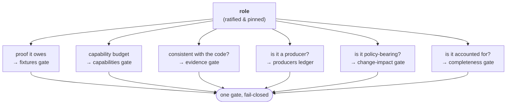

---
hide:
  - navigation
---

# celebrimbor

**Invariant-driven design as a framework.** An omakase quality harness that
makes every unit of your application carry its own falsifier — and makes the
gate fail closed: refuse when it cannot prove, never estimate.

```bash
pip install celebrimbor
celebrimbor init
celebrimbor gate --fast
```

---

## The problem it solves

A claim a system cannot contradict is a claim it will eventually get wrong.

Your linter checks style. Your type checker checks shapes. Your tests check the
cases you thought to write. None of them check that the code is *what it says it
is* — and that gap, between plausible and correct, is exactly where bugs live.
It is also where AI-generated code lives, because a language model optimizes for
plausibility. A hallucination is output that looks right and carries no proof.

An AI can hand you a `verify_*` function that always returns `True`, a parser
that never rejects bad input, a "pure" helper that secretly reads the clock, or
a test that asserts nothing — and every one passes your linter, your types, and
the tests the AI wrote alongside them.

Celebrimbor closes that vacuum. **Every unit carries its own falsifier, and the
gate fails closed.** It is the layer above the commodity ladder that makes your
claims falsifiable, so "it looks right" is no longer enough to ship.

[Why celebrimbor →](concepts/why.md){ .md-button .md-button--primary }
[Get started →](getting-started.md){ .md-button }

---

## One idea, applied relentlessly

Every callable has a **role**, and a role names the *kind of proof it owes*.

| Role | Owes |
|---|---|
| `pure` | a property or unit test over its contract |
| `parser` | a unit test with malformed input that must be refused |
| `normalizer` | a property test (idempotence and folding) |
| `verifier` | a negative fixture that must turn it red |
| `producer` | proof through the verifier that inspects its artifact |
| `orchestrator` | an interaction test over its dependency edges |
| `adapter` | a contract test against fake and real backends |
| `presenter` | an integration or end-to-end run |

The role is the spine. One ratified-then-pinned classification decides
everything downstream, so the gates reinforce each other instead of each seeing
its own slice:



Because every gate reads the same source of truth, the capability gate can be
trusted only because the evidence gate proved the role honest, and the impact
gate is meaningful only because the surface map is provably complete.

[Roles &amp; obligations →](concepts/roles.md)

---

## Two families, twenty gates

<div class="grid cards" markdown>

-   **The commodity ladder**

    ---

    Lint, types, format, complexity, cohesion, known-bad, marker grammar. Wired
    with opinionated defaults, green on a fresh repo in under ten minutes — the
    adoption wedge.

    ```bash
    celebrimbor gate --fast
    ```

-   **The obligation engine**

    ---

    Surface-role completeness, capability injection, no-blind-verifier
    producers, the invariant ledger, change-impact, coverage & mutation
    ratchets. Opt-in and authored, so it never reddens day one.

    ```bash
    celebrimbor init --surfaces
    ```

</div>

Every gate carries a negative fixture proving it can turn red — a gate that has
never been observed to fail is a blind gate, and celebrimbor does not ship them,
including its own.

[The gate: stages & families →](gate/stages-and-families.md)

---

## Proof it's real: celebrimbor gates itself

celebrimbor runs its full obligation engine against its own source and ships
green — 242 callables classified under 49 pinned rows, 14 producers proved
through real verifiers, 8 critical invariants each with a negative proof, every
module import-clean.
Turning it on found a bug in the tool, forced a dependency-injection fix on its
own runner, and left exactly one debt on a dated `pending` list rather than
papering over it.

A quality tool that cannot pass its own gate is asking you to do something it
will not.

[celebrimbor on celebrimbor →](concepts/self-hosting.md)

---

## Built for the AI era

The gate is an adversary a model cannot talk its way past:

- It cannot ship a **blind verifier** — the evidence gate detects "can never
  turn red" from the syntax tree.
- It cannot ship a **pure function that touches the world** — the capability
  gate sees the un-injected reach.
- It cannot ship a **check with no falsifier** — the decorator won't accept one.
- It cannot **quietly change what a module does** — ratification is pinned to
  the code's shape, so a rewrite re-opens the question.

You keep AI velocity, with a falsifier always in reach.

[Why celebrimbor, and not a pile of tools →](concepts/why.md)
