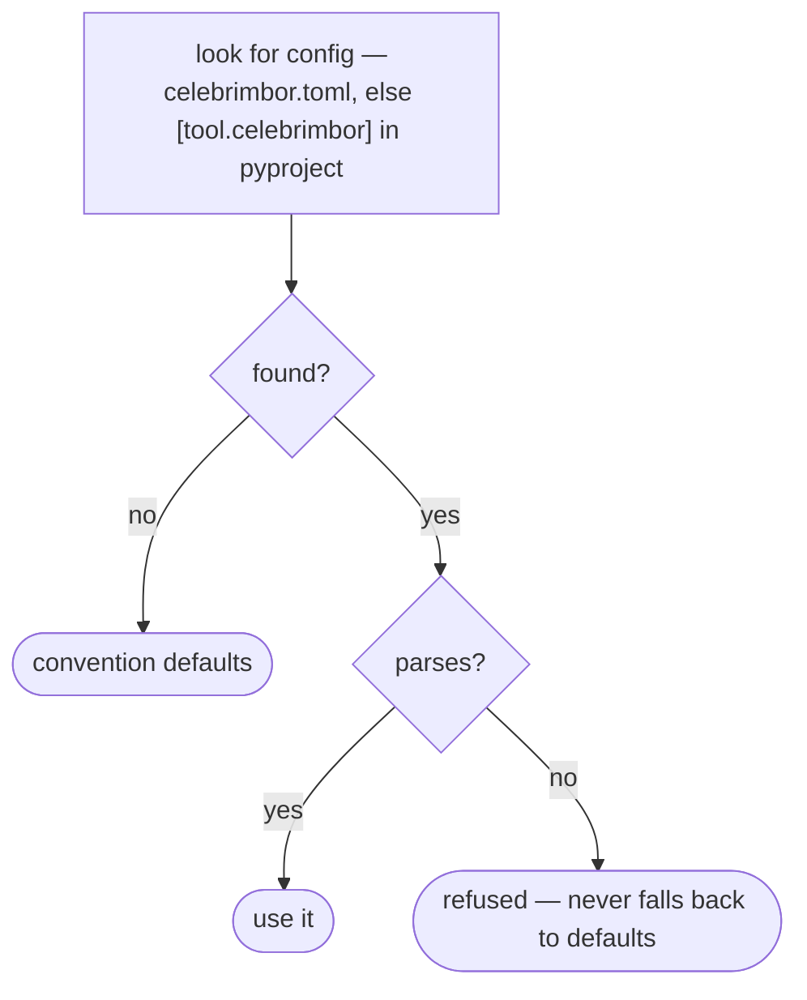

# Configuration reference

Config is for the **exceptions only** — good defaults cover the rest. Every
setting already has a value that works on a normally laid-out project, so the
config file is optional. If you need to write config just to get started, then the
defaults are wrong — and that is a bug to report, not a knob for you to turn.

Settings live under `[tool.celebrimbor]` in `pyproject.toml`, or in a dedicated
`celebrimbor.toml` (which wins if both exist). How celebrimbor finds your config
is spelled out below, and a broken file never quietly falls back to the defaults:



## Layout

```toml
[tool.celebrimbor]
source = "src"                 # source prefix (inferred if omitted)
tests = "tests"
known_bad = "tests/known-bad"
```

If a config file exists but is broken, celebrimbor **stops and refuses** — it
never falls back to the defaults. You asked for something specific; quietly doing
something else instead would be exactly the kind of guessing this tool refuses to
do.

## Environment

```toml
[tool.celebrimbor]
trusted_environment = true     # a missing tool is red, not a skip
pinned_environment = true      # ratchets may baseline here
```

Both turn on automatically when they detect a CI environment (`CI=1`, or the usual
CI environment variables, or `CELEBRIMBOR_TRUSTED=1`). You rarely set them by hand
— CI sets them for you. In a *trusted* environment, a tool that should be there
but isn't is treated as red, not skipped. A *pinned* environment is the one place
allowed to reset a check's baseline (more on baselines below).

## Your own checks and checkers

```toml
[tool.celebrimbor]
# App @check modules the CLI imports so `celebrimbor gate` runs your gates too.
check_modules = ["myapp.quality_checks"]

[tool.celebrimbor]
# An app's own deterministic mutation set, in place of running mutmut. The
# callable returns frozenset[celebrimbor.Survivor]; the survivor-identity ratchet
# gates it (see gate/ratchets).
mutation_survivors = "myapp.mutation:survivors"

# A domain linter that proves its own tests/known-bad/ fixtures (beyond ruff/mypy).
# Either a subprocess `command` (with {file}) or an in-process `callable`
# ("module:function" returning the diagnostics); `match` is "exact" or "substring".
[tool.celebrimbor.known_bad_checkers.style_audit]
callable = "myapp.editorial:diagnostics_for"     # or: command = "... {file}"
match = "substring"                              # for phrase-emitting linters
```

`check_modules` is covered in [Writing custom checks](../guides/custom-checks.md);
`known_bad_checkers` in [Fixtures & markers](../gate/fixtures.md); and
`mutation_survivors` in [Ratchets](../gate/ratchets.md). Each is the same kind of
plug-in point — you supply the tooling, and celebrimbor runs it under the same
rules as everything else. If one of your sources won't import or won't run,
that's a hard error and the gate stops. It will never quietly run a smaller gate
because one of your checks failed to load.

## Ledger paths

A *ledger* is a file where celebrimbor records the judgments and promises you have
confirmed. If your project already keeps these files somewhere, point celebrimbor
at them here instead of moving them under `.celebrimbor/`. This is what lets a
project with an existing `quality/` directory adopt the tool without reorganizing
anything.

```toml
[tool.celebrimbor.paths]
surfaces = "quality/surfaces.yaml"
invariants = "quality/invariants.yaml"
producers = "quality/producers.yaml"
coverage_baseline = "quality/coverage-baseline.yaml"
mutation_baseline = "quality/mutation-baseline.yaml"
structure_baseline = "quality/structure-baseline.yaml"
```

An unknown key here is an error, not something to ignore — otherwise a typo in an
override would leave celebrimbor quietly reading the default location while you
believed you had pointed it somewhere else.

## Structure budgets

```toml
[tool.celebrimbor.limits]
complexity = 10
nesting = 4
max_statements = 50
max_params = 5              # positional, excluding self/cls
max_keyword_params = 8
max_returns = 8
max_function_lines = 80
max_file_lines = 500
max_domains_per_file = 1
max_public_callables = 20
```

Every value is a ceiling. An unknown limit key is an error — if a typo were
silently dropped, it would look like a budget you had set that was quietly not
being enforced.

## Other

```toml
[tool.celebrimbor]
min_coverage_floor = 60.0      # the low-floor meta-ratchet threshold
formatter = "ruff-format"
mutation_tool = "mutmut"
import_check = true            # opt in to the runtime import-health gate (it imports your code)
markers_cite_limitations = true  # xfail/skip reason= must cite a declared invariant limitation
exclude = ["*/generated/*"]    # globs excluded from the surface inventory
disabled_checks = ["celebrimbor.mutation"]   # exceptions, on the record

# Your own @check modules. The CLI imports each so `celebrimbor gate` runs your
# domain checks too — not only the builtins. A module that will not import is a
# hard, fail-closed error, never a silently smaller gate.
check_modules = ["myapp.quality_checks"]

# Which roles the change-impact gate governs. Empty = the default
# (parser, normalizer, verifier, producer, adapter, orchestrator). Set it to
# match an existing harness's notion of a policy role. An unknown role name is
# an error, not ignored — a typo would silently shrink what is governed.
policy_roles = ["verifier", "parser", "producer", "adapter", "orchestrator"]

# Capabilities that any role may reach for ambiently, because they are this
# app's tested domain medium rather than an injectable side effect — a
# file-processing tool tests its filesystem reads directly. Listed capabilities
# are still scanned and reported, just not a breach. Empty = the strict default
# (only `adapter` may touch any capability ambiently). An unknown capability
# name is an error, so the opt-in stays honest and on the record.
ambient_capabilities = ["filesystem"]
```

Disabling a check shows up in every run — it's an exception on the record, not a
place to hide something.

First, some vocabulary for that last setting. A *capability* is a piece of the
outside world a function reaches for: the clock, the network, files, randomness.
There are two ways a function can get one. *Injected* means the outside thing is
handed in as an argument, so a test can swap in a fake. *Ambient* (or reached-for)
means the function grabs it directly, so no test can stand in its way. The
[capability gate](../gate/capabilities.md) normally allows only one role —
`adapter` — to reach for capabilities ambiently.

`ambient_capabilities` is a deliberately narrow way out of that rule. It says:
"this capability is what my app *is*, so reaching for it directly is fine here."
Reserve it for the medium you actually test all the way through — `filesystem` for
a file tool, `database` for a query layer. The truly un-fakeable capabilities
(`clock`, `network`, `random`) do not belong here: their behaviour is exactly what
no test can reach, which is the whole reason the gate wants them handed in rather
than grabbed. Naming one of those is allowed, but it's a warning sign, not a fix.

## State directory

By default celebrimbor keeps its ledgers and baselines under `.celebrimbor/` in
your repo. These are **committed to git** — they are the record of the judgments
your team has confirmed and the history of every one-way quality gate you've
tightened, not a throwaway cache. The only thing that belongs in `.gitignore` is
`.celebrimbor/cache/`.
